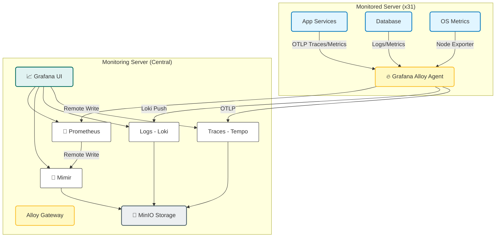

# PHÂN TÍCH VẤN ĐỀ VÀ LỰA CHỌN GIẢI PHÁP (UPDATED)

> **Tài liệu này phân tích bài toán monitoring thực tế, so sánh các giải pháp và lý giải kiến trúc LGTM Stack + Grafana Alloy hiện tại.**

## 📋 Mục lục

- [1. Bối cảnh và Vấn đề](#1-bối-cảnh-và-vấn-đề)
- [2. Yêu cầu Hệ thống](#2-yêu-cầu-hệ-thống)
- [3. So sánh Giải pháp](#3-so-sánh-giải-pháp)
- [4. Kiến trúc Được Lựa chọn (Final Decision)](#4-kiến-trúc-được-lựa-chọn-final-decision)
- [5. Roadmap Triển khai](#5-roadmap-triển-khai)

---

## 1. Bối cảnh và Vấn đề

### 1.1. Hiện trạng Hạ tầng
- **Quy mô**: 31+ Servers (Vật lý & Virtual).
- **Môi trường**: Production, Staging, Dev.
- **Tech Stack**:
    - App: NestJS, Node.js.
    - DB: MongoDB, PostgreSQL.
    - Proxy: Nginx.
    - Container: Docker & Docker Compose.

### 1.2. Pain Points (Nỗi đau hiện tại)

1.  **Mù thông tin (Zero Visibility)**:
    - Không biết server nào CPU cao, RAM đầy cho đến khi sập.
    - Không giám sát được database connection pool, slow query.

2.  **Khó Troubleshooting**:
    - Khi có lỗi, DevOps phải SSH vào từng server → `tail -f` log.
    - Mất trung bình 2-4 giờ để tìm ra nguyên nhân (MTTR cao).

3.  **Rời rạc (Silos)**:
    - Metrics (CPU) nằm ở một nơi.
    - Logs nằm trên file text ở server khác.
    - Không liên kết được: "Lúc CPU tăng cao thì log đang báo lỗi gì?".

---

## 2. Yêu cầu Hệ thống

### 2.1. Yêu cầu Chức năng (Functional)
| Req ID | Mô tả | Mức độ |
|--------|-------|--------|
| **FR-01** | **Unified Agent**: Chỉ chạy 1 agent duy nhất trên server để tiết kiệm resource. | Critical |
| **FR-02** | **Centralized Logging**: Gom logs từ 31 server về 1 chỗ. | Critical |
| **FR-03** | **Long-term Storage**: Lưu metrics > 1 năm để báo cáo xu hướng. | High |
| **FR-04** | **Correlation**: Nhảy từ Metrics → Traces → Logs mượt mà. | High |
| **FR-05** | **Alerting**: Báo qua Telegram ngay khi có sự cố. | Critical |

### 2.2. Yêu cầu Phi chức năng (Non-functional)
- **Chi phí**: Tối ưu (ưu tiên Open Source), tránh Vendor Lock-in (Datadog).
- **Performance**: Agent tiêu tốn < 2% CPU, < 200MB RAM.
- **High Availability**: Không mất dữ liệu khi network chập chờn (cần cơ chế Buffer/Retry).

---

## 3. So sánh Giải pháp

Chúng ta đã cân nhắc 3 hướng đi chính:

### Option 1: ELK Stack (Legacy)
*   **Gồm**: Elasticsearch, Logstash, Kibana.
*   **Đánh giá**:
    *   ❌ **Nặng nề**: Elasticsearch tốn quá nhiều RAM (Java heap).
    *   ❌ **Chi phí lưu trữ cao**: Index full-text content của log.
    *   ❌ **Chuyên về Log**: Khả năng xử lý Metrics/Traces yếu hơn.

### Option 2: SaaS (Datadog/NewRelic)
*   **Đánh giá**:
    *   ✅ **Nhanh gọn**: Cài agent là xong.
    *   ❌ **Quá đắt**: Với 31 servers, chi phí ~ $15,000/năm.
    *   ❌ **Metrics Custom**: Bị tính tiền thêm trên từng metric.

### Option 3: LGTM Stack (Proposed)
*   **Gồm**: Loki, Grafana, Tempo, Mimir.
*   **Đánh giá**:
    *   ✅ **Tối ưu chi phí**: Loki không index full text -> Storage rẻ hơn ELK 10 lần.
    *   ✅ **Unified**: Grafana hiển thị cả 3 trụ cột (M-L-T).
    *   ✅ **Grafana Alloy**: Agent thế hệ mới, thay thế cả Promtail và OTel Collector.
    *   ✅ **Mimir**: Giải quyết bài toán lưu trữ lâu dài (Long-term) mà Prometheus native không làm tốt.

👉 **Quyết định: Chọn Option 3 (LGTM Stack)**.

---

## 4. Kiến trúc Được Lựa chọn (Final Decision)

Hệ thống giám sát sẽ được triển khai theo mô hình **Pull-Push Hybrid** với **Grafana Alloy** làm trung tâm.

### 4.1. Sơ đồ Kiến trúc

### 4.2. Các thành phần mấu chốt

1.  **Collector: Grafana Alloy** (Thay thế Promtail + OTel Collector)
    - **Vai trò**: "Swiss Army Knife" of observability.
    - **Lợi ích**:
        - Đọc Docker Logs, System Logs.
        - Nhận OTLP Traces từ App.
        - Scrape Metrics từ Exporter.
        - Xử lý (Filter, Relabel, Batch) tại nguồn trước khi gửi đi.

2.  **Long-term Storage: Mimir**
    - Prometheus thông thường chỉ giữ data 15 ngày.
    - Mimir + MinIO (S3) giúp lưu data **390 ngày** (hoặc vĩnh viễn) với chi phí rẻ.

3.  **Storage Backend: MinIO**
    - Tận dụng Object Storage cho cả Loki, Tempo, Mimir.
    - Dễ dàng backup/restore và mở rộng dung lượng giá rẻ.

---

## 5. Roadmap Triển khai

### Phase 1: Core Foundation (Done)
- [x] Dựng Monitoring Server (Docker Compose).
- [x] Cấu hình MinIO, Mimir, Loki, Tempo.
- [x] Setup Grafana Dashboard cơ bản.

### Phase 2: Agent Rollout (Current)
- [ ] Cài đặt Grafana Alloy lên các server vệ tinh.
- [ ] Cấu hình Alloy để scrape Node Exporter & Docker Logs.
- [ ] Apply "Blackbox Exporter" để check uptime các web public.

### Phase 3: Application Instrumentation (Next)
- [ ] Tích hợp thư viện OpenTelemetry vào NestJS App.
- [ ] Cấu hình App đẩy logs dạng JSON để Alloy parse tốt hơn.
- [ ] Setup Alert Rules cho Business Metrics (Error Rate > 1%, High Latency).

### Phase 4: Advanced & Optimization
- [ ] Tuning Retention Policy (Log giữ 30 ngày, Metrics giữ 1 năm).
- [ ] Setup Service Graph trong Tempo.
- [ ] Training team cách dùng LogQL/TraceQL.

---

## 6. Kết luận

Giải pháp **LGTM Stack + Grafana Alloy** giải quyết triệt để các bài toán:
1.  **Chi phí**: Tận dụng Open Source và MinIO để giảm chi phí lưu trữ.
2.  **Vận hành**: Alloy đơn giản hóa việc quản lý agent (1 binary duy nhất).
3.  **Mở rộng**: Kiến trúc tách rời Storage (MinIO) và Compute (Mimir/Loki) giúp dễ dàng scale khi số lượng server tăng lên 100+.
