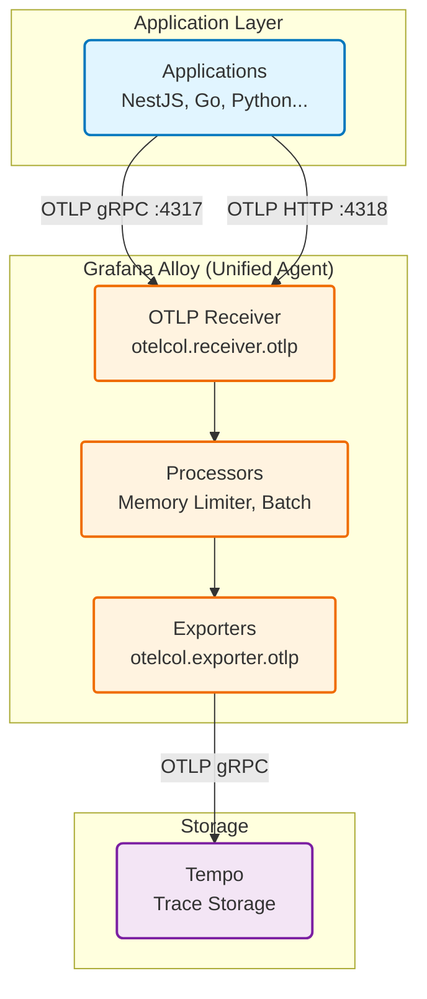

# TRACES - Hệ thống Distributed Tracing

## 🎯 Tracing là gì và Tại sao cần Tracing?

### Định nghĩa

**Distributed Tracing** là kỹ thuật theo dõi một request khi nó đi qua nhiều services khác nhau trong hệ thống microservices. Mỗi request được gán một **Trace ID** duy nhất, và mỗi bước xử lý trong các services tạo ra các **Spans**.

### Khái niệm cơ bản

```
Request: GET /api/order/123

Trace ID: abc-def-123
│
├─ Span 1: API Gateway (50ms)
│  │
│  ├─ Span 2: Auth Service (10ms)
│  │
│  ├─ Span 3: Order Service (35ms)
│     │
│     ├─ Span 4: Database Query (20ms)
│     │
│     └─ Span 5: Cache Lookup (5ms)
│
└─ Total: 50ms
```

**Trace**: Toàn bộ journey của 1 request  
**Span**: 1 đơn vị công việc trong trace (function call, DB query, HTTP request)  
**Trace ID**: Định danh duy nhất cho trace  
**Span ID**: Định danh duy nhất cho span  
**Parent Span ID**: Liên kết spans thành cây

### Tại sao Tracing quan trọng?

#### 1. **Debugging Microservices**

**Vấn đề**: Request chậm, nhưng không biết chậm ở đâu?

**Không có Tracing:**
```
User: "API /checkout chậm quá!"
Dev: "Hmm... có thể là:
  - Payment service?
  - Inventory service?
  - Database?
  - Network?
  - ...?"
→ Phải check logs từng service, đoán mò
```

**Có Tracing:**
```
Trace cho request chậm:
├─ API Gateway: 2ms ✅
├─ Auth Service: 5ms ✅
├─ Checkout Service: 3ms ✅
├─ Payment Service: 2500ms ❌ ← ĐÂY RỒI!
│  └─ External API call: 2480ms ← Timeout từ payment gateway
└─ Inventory Service: 10ms ✅

→ Biết ngay vấn đề ở Payment Service gọi external API
```

#### 2. **Performance Optimization**

Xác định bottlenecks:
```
Trace: /api/user/profile (total: 450ms)
├─ Load user: 50ms
├─ Load posts: 200ms ← Chậm
│  ├─ DB query: 180ms ← N+1 query problem
│  └─ Process: 20ms
├─ Load friends: 150ms ← Chậm
│  └─ DB query: 145ms ← Missing index
└─ Render: 50ms

→ Biết cần optimize 2 queries này
```

#### 3. **Understanding Dependencies**

Visualize service dependencies:
```
Frontend
   │
   ├──▶ API Gateway
        │
        ├──▶ User Service
        │     └──▶ PostgreSQL
        │
        ├──▶ Order Service
        │     ├──▶ MongoDB
        │     └──▶ Inventory Service
        │           └──▶ Redis
        │
        └──▶ Notification Service
              └──▶ Email Service (External)
```

#### 4. **Error Correlation**

Liên kết errors qua nhiều services:
```
Trace ID: xyz-789
├─ Frontend: Error 500
├─ API Gateway: Passed through
├─ Order Service: Exception thrown
│  └─ Error: "Inventory not available"
└─ Inventory Service: Database connection timeout
   └─ Root cause: PostgreSQL down

→ Biết error 500 ở frontend thực ra do PostgreSQL down
```

## 🏗️ Kiến trúc Tracing trong Hệ thống

## 🏗️ Kiến trúc Tracing trong Hệ thống



## 🔧 Cấu hình Grafana Alloy cho Traces

**Grafana Alloy** thay thế OpenTelemetry Collector để thu thập, xử lý và forward traces. Cấu hình nằm trong file `alloy/config.alloy`.

### 1. Unified Telemetry Flow

Khác với OTEL Collector (YAML), Alloy sử dụng các **component blocks** để định nghĩa pipeline:

```alloy
// 1. Nhận Traces từ Applications (OTLP Receiver)
otelcol.receiver.otlp "default" {
  grpc {
    endpoint = "0.0.0.0:4317" // Nhận gRPC traces
  }

  http {
    endpoint = "0.0.0.0:4318" // Nhận HTTP traces
  }

  output {
    // Send to processing pipeline
    metrics = [otelcol.processor.memory_limiter.default.input]
    traces  = [otelcol.processor.memory_limiter.default.input]
    logs    = [otelcol.processor.memory_limiter.default.input]
  }
}
```

### 2. Processing Pipeline

```alloy
// 2. Bảo vệ memory (Memory Limiter)
otelcol.processor.memory_limiter "default" {
  check_interval = "1s"
  limit          = "400MiB"
  spike_limit    = "100MiB"

  output {
    metrics = [otelcol.processor.batch.default.input]
    traces  = [otelcol.processor.batch.default.input]
    logs    = [otelcol.processor.batch.default.input]
  }
}

// 3. Tối ưu network (Batch Processor)
otelcol.processor.batch "default" {
  timeout             = "5s"
  send_batch_size     = 8192
  send_batch_max_size = 10000

  output {
    // Fan-out đến các exporters
    metrics = [otelcol.exporter.prometheus.otlp_metrics.input]
    traces  = [otelcol.exporter.otlp.tempo.input]
    logs    = [otelcol.exporter.loki.otlp_logs.input]
  }
}
```

### 3. Export to Tempo

```alloy
// 4. Gửi Traces đến Tempo
otelcol.exporter.otlp "tempo" {
  client {
    endpoint = "tempo:4317"
    tls {
      insecure = true
    }
  }
}
```

### So sánh OTEL Collector vs Alloy

| Feature | OTEL Collector (YAML) | Alloy (Block Syntax) |
|---------|-----------------------|----------------------|
| **Pipeline** | `receivers` -> `processors` -> `exporters` | Components connected by `input`/`output` |
| **Integrations** | Cần enable receiver tương ứng | Native support cho Docker, File, System |
| **Config** | Static YAML | Dynamic, Scriptable |

### 2. Tempo - Trace Storage Backend

**Tempo** là distributed tracing backend của Grafana Labs, tối ưu cho cost-effective storage.

#### Đặc điểm

**1. Write Path:**
```
Collector ──▶ Distributor ──▶ Ingester ──▶ Storage
                                │
                                └──▶ WAL (Write-Ahead Log)
```

- **Distributor**: Nhận traces, hash trace_id để route đến ingester
- **Ingester**: Buffer traces trong memory, flush định kỳ
- **WAL**: Durability, tránh mất data nếu crash

**2. Storage:**

```yaml
storage:
  trace:
    backend: local
    local:
      path: /var/tempo/traces
    wal:
      path: /var/tempo/wal
```

**Backend options:**
- **local**: Filesystem (development/small scale)
- **s3**: AWS S3 (production)
- **gcs**: Google Cloud Storage
- **azure**: Azure Blob Storage

**Tại sao dùng object storage (S3/GCS)?**
- **Cost**: $0.023/GB/month (S3) vs $0.10/GB/month (EBS)
- **Scalability**: Unlimited storage
- **Durability**: 99.999999999% (11 nines)

**3. Compaction:**

```yaml
compactor:
  compaction:
    block_retention: 168h  # 7 days
```

**Cách hoạt động:**
```
Ingester tạo blocks mỗi 5 phút:
block-001 (0-5min)
block-002 (5-10min)
block-003 (10-15min)
...

Compactor gộp blocks:
block-001 + block-002 + ... + block-12 → block-hour-1 (0-60min)
block-hour-1 + ... + block-hour-24 → block-day-1 (0-24h)

Xóa blocks cũ hơn 168h
```

**Lợi ích:**
- Giảm số lượng files
- Query nhanh hơn (ít files phải scan)
- Tiết kiệm storage (compression tốt hơn)

#### Metrics Generator

**Tính năng đặc biệt**: Tempo có thể generate metrics từ traces!

```yaml
metrics_generator:
  registry:
    external_labels:
      source: tempo
      cluster: docker-compose
    collection_interval: 15s
  storage:
    path: /var/tempo/generator/wal
    remote_write:
      - url: http://prometheus:9090/api/v1/write
        send_exemplars: true
```

**Processor types:**

**1. Service Graphs**

```yaml
processor:
  service_graphs:
    max_items: 10000
```

**Output**: Metrics về service-to-service calls

```promql
# Request rate giữa services
traces_service_graph_request_total{client="frontend", server="api-gateway"} 1000

# Latency
traces_service_graph_request_duration_seconds{client="frontend", server="api-gateway"} 0.05

# Failed requests
traces_service_graph_request_failed_total{client="frontend", server="api-gateway"} 10
```

**Sử dụng**: Vẽ service dependency graph trong Grafana

**2. Span Metrics**

```yaml
processor:
  span_metrics:
    dimensions:
      - http.method
      - http.target
      - http.status_code
      - service.version
```

**Output**: Metrics từ span attributes

```promql
# Request duration by endpoint
traces_span_metrics_duration_seconds{http_method="GET", http_target="/api/users", http_status_code="200"}

# Request count
traces_span_metrics_calls_total{http_method="POST", http_target="/api/orders"}
```

**3. Exemplars**

**Exemplars** = Link từ metric data point đến trace cụ thể.

```
Metric: http_request_duration_seconds
Value: 0.5s at timestamp 1735574400

Exemplar: {
  value: 0.5
  timestamp: 1735574400
  trace_id: "abc123..."  ← Link to trace
  span_id: "def456..."
}
```

**Workflow trong Grafana:**
```
1. Xem metric graph: Response time tăng đột ngột
2. Click vào spike point
3. Grafana hiển thị exemplar traces
4. Click vào trace → Xem chi tiết trace
5. Debug tại sao request này chậm
```

**Lợi ích:**
- Jump từ "có vấn đề" (metrics) → "vấn đề cụ thể là gì" (trace)
- Không cần search trace ID manually

### 4. Trace Query và Visualization

#### Query Traces trong Grafana

**1. Trace ID Search:**
```
Trace ID: abc-def-123
→ Hiển thị toàn bộ trace với tất cả spans
```

**2. TraceQL (Trace Query Language):**

```traceql
# Tìm traces chậm
{ duration > 1s }

# Traces có errors
{ status = error }

# Traces từ service cụ thể
{ service.name = "api-gateway" }

# Traces với HTTP 500
{ span.http.status_code = 500 }

# Complex query
{
  service.name = "order-service" &&
  duration > 500ms &&
  span.http.method = "POST"
}
```

**3. Metrics to Traces:**

```
Prometheus query: rate(http_requests_total[5m])
→ Click vào data point
→ Grafana tìm exemplar trace
→ Jump to trace view
```

#### Trace Visualization

**Waterfall View:**
```
Trace: GET /api/order/123 (total: 450ms)
│
├─────────────────────────────────────────────────────── Timeline
│
├─ API Gateway                    [████░░░░░░░░░░░░░░░░] 50ms
│  │
│  ├─ Auth Service                [██░░░░░░░░░░░░░░░░░░] 10ms
│  │
│  └─ Order Service               [████████░░░░░░░░░░░░] 350ms
│     │
│     ├─ Validate Order           [██░░░░░░░░░░░░░░░░░░] 20ms
│     │
│     ├─ Check Inventory          [████░░░░░░░░░░░░░░░░] 50ms
│     │  │
│     │  └─ Redis GET             [██░░░░░░░░░░░░░░░░░░] 5ms
│     │
│     ├─ Process Payment          [██████████░░░░░░░░░░] 250ms ← Bottleneck!
│     │  │
│     │  └─ External Payment API  [█████████░░░░░░░░░░░] 240ms
│     │
│     └─ Save to DB               [████░░░░░░░░░░░░░░░░] 30ms
│        │
│        └─ PostgreSQL INSERT     [███░░░░░░░░░░░░░░░░░] 25ms
│
└─ Response                       [░░░░░░░░░░░░░░░░░░░░] 0ms
```

**Span Details:**
```
Span: Process Payment
├─ Duration: 250ms
├─ Status: OK
├─ Attributes:
│  ├─ payment.method: "credit_card"
│  ├─ payment.amount: 99.99
│  ├─ payment.currency: "USD"
│  └─ payment.gateway: "stripe"
├─ Events:
│  ├─ [10ms] Payment request sent
│  ├─ [240ms] Payment response received
│  └─ [250ms] Payment confirmed
└─ Links:
   └─ Related trace: order-confirmation-email
```

**Service Graph:**
```
┌──────────┐
│ Frontend │
└────┬─────┘
     │ 1000 req/s
     │ 50ms avg
     ▼
┌──────────────┐
│ API Gateway  │
└──┬────────┬──┘
   │        │
   │        │ 800 req/s
   │        │ 100ms avg
   │        ▼
   │   ┌────────────┐
   │   │   Auth     │
   │   └────────────┘
   │
   │ 1000 req/s
   │ 200ms avg
   ▼
┌──────────────┐
│Order Service │
└──┬────────┬──┘
   │        │
   │        │ 500 req/s
   │        │ 50ms avg
   │        ▼
   │   ┌────────────┐
   │   │ Inventory  │
   │   └────────────┘
   │
   │ 1000 req/s
   │ 150ms avg
   ▼
┌──────────────┐
│   Payment    │
└──────────────┘
```

## 🔍 Instrumentation Best Practices

### 1. Span Naming

**Good:**
```
GET /api/users
POST /api/orders
SELECT users WHERE id = ?
Redis GET user:123
```

**Bad:**
```
handleRequest
doWork
query
fetch
```

**Principles:**
- Descriptive: Biết span làm gì
- Consistent: Cùng format trong toàn bộ hệ thống
- Low cardinality: Không include IDs, user-specific data

### 2. Span Attributes

**Good:**
```javascript
span.setAttribute("http.method", "GET")
span.setAttribute("http.url", "/api/users")
span.setAttribute("http.status_code", 200)
span.setAttribute("db.system", "postgresql")
span.setAttribute("db.statement", "SELECT * FROM users WHERE id = ?")
```

**Bad:**
```javascript
span.setAttribute("user_id", "12345")  // High cardinality
span.setAttribute("request_body", "{...}")  // Too large
span.setAttribute("password", "secret")  // Sensitive data
```

**Semantic Conventions**: Sử dụng standard attributes từ OpenTelemetry
- `http.*`: HTTP requests
- `db.*`: Database operations
- `messaging.*`: Message queues
- `rpc.*`: RPC calls

### 3. Span Events

**Sử dụng events cho điểm quan trọng trong span:**

```javascript
span.addEvent("cache_miss", {
  "cache.key": "user:123",
  "cache.ttl": 3600
})

span.addEvent("validation_failed", {
  "validation.field": "email",
  "validation.error": "invalid format"
})

span.addEvent("retry_attempt", {
  "retry.count": 2,
  "retry.max": 3
})
```

### 4. Error Handling

```javascript
try {
  // Do work
  span.setStatus({ code: SpanStatusCode.OK })
} catch (error) {
  span.setStatus({
    code: SpanStatusCode.ERROR,
    message: error.message
  })
  span.recordException(error)
  throw error
}
```

### 5. Sampling

**Vấn đề**: 100% traces = quá nhiều data, tốn storage, tốn tiền.

**Giải pháp**: Sampling - chỉ giữ một phần traces.

**Sampling strategies:**

**1. Head-based Sampling** (quyết định ở đầu trace):
```
Random: 10% of all traces
Rate limiting: Max 100 traces/second
```

**2. Tail-based Sampling** (quyết định sau khi trace hoàn thành):
```
Keep if:
  - Duration > 1s
  - Has errors
  - Status code 5xx
  - Random 1% of normal requests
```

**Cấu hình trong Collector:**
```yaml
processors:
  probabilistic_sampler:
    sampling_percentage: 10  # Keep 10%
  
  tail_sampling:
    policies:
      - name: errors
        type: status_code
        status_code: {status_codes: [ERROR]}
      - name: slow
        type: latency
        latency: {threshold_ms: 1000}
      - name: random
        type: probabilistic
        probabilistic: {sampling_percentage: 1}
```

## 💡 Use Cases

### 1. Debugging Slow Requests

**Scenario**: API `/api/dashboard` đôi khi chậm.

**Bước 1**: Query slow traces
```traceql
{
  span.http.target = "/api/dashboard" &&
  duration > 2s
}
```

**Bước 2**: Phân tích waterfall
```
Trace 1: 3.5s total
├─ Load user: 50ms
├─ Load widgets: 3.2s ← Bottleneck
│  └─ DB query: 3.1s ← N+1 query
└─ Render: 200ms
```

**Bước 3**: Fix N+1 query, verify
```
Trace 2 (after fix): 400ms total
├─ Load user: 50ms
├─ Load widgets: 150ms ← Fixed!
│  └─ DB query: 100ms
└─ Render: 200ms
```

### 2. Finding Error Root Cause

**Scenario**: User báo lỗi 500.

**Bước 1**: Tìm trace với error
```traceql
{
  span.http.status_code = 500 &&
  service.name = "api-gateway"
}
```

**Bước 2**: Follow trace tree
```
API Gateway: 500 ← User thấy
└─ Order Service: Exception
   └─ Payment Service: Timeout
      └─ External API: Connection refused
         → Root cause: Payment gateway down
```

### 3. Capacity Planning

**Query service graph metrics:**
```promql
# Request rate trend
rate(traces_service_graph_request_total[1h])

# P95 latency trend
histogram_quantile(0.95, 
  rate(traces_service_graph_request_duration_seconds_bucket[5m])
)
```

**Insight:**
- Order Service: 1000 req/s hiện tại
- Tăng 20%/tháng
- P95 latency: 200ms (gần limit 250ms)
→ Cần scale trong 2 tháng

## 🎓 Tổng kết

### Tracing Flow Summary

1. **Application** instrument với OpenTelemetry SDK
2. **Spans** được tạo cho mỗi operation
3. **OTLP** gửi spans đến OpenTelemetry Collector
4. **Collector** process (batch, sample) và export
5. **Tempo** lưu trữ traces
6. **Metrics Generator** tạo metrics từ spans → Prometheus
7. **Grafana** query và visualize traces

### Key Takeaways

✅ **Tracing = Following requests through microservices**  
✅ **Trace = Collection of spans với cùng trace_id**  
✅ **OpenTelemetry = Vendor-neutral instrumentation standard**  
✅ **Collector = Central pipeline cho telemetry data**  
✅ **Tempo = Cost-effective trace storage**  
✅ **Exemplars = Bridge từ metrics → traces**  

### Khi nào dùng Tracing?

- ✅ Debug microservices (request đi qua nhiều services)
- ✅ Tìm performance bottlenecks
- ✅ Understand service dependencies
- ✅ Root cause analysis cho errors
- ✅ Latency breakdown (thời gian ở đâu?)
- ❌ System-wide trends (dùng Metrics)
- ❌ Detailed logs (dùng Logs)
- ❌ Audit trail (dùng Logs)
