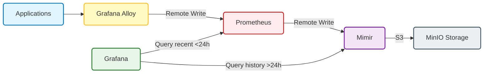

# 🚀 Grafana Mimir - Long-term Metrics Storage Setup

## 📋 Tổng quan

**Grafana Mimir** được cấu hình làm **backend lưu trữ dài hạn (Long-term Storage)** cho Prometheus.
*   **Prometheus**: Giữ metrics ngắn hạn (5 ngày) để query nhanh và alerting.
*   **Mimir**: Giữ metrics dài hạn (**> 1 năm**) để báo cáo, trend analysis và capacity planning.

---

## 🏗️ Architecture & Data Flow

Hệ thống hoạt động theo mô hình **Hybrid Storage**:



### Configuration Highlights (Based on `mimir-config.yml`)
*   **Mode**: Monolithic (`-target=all` - chạy tất cả components trong 1 container).
*   **Storage Backend**: S3 (MinIO).
*   **Multitenancy**: Enabled (Mặc định header `X-Scope-OrgID: demo`).
*   **Replication Factor**: 1 (Single node setup).

---

## ⚙️ Chi tiết Cấu hình (Deep Dive)

### 1. Storage & Retention (Lưu trữ)
Mimir sử dụng **MinIO** làm Object Storage để lưu blocks.

*   **TSDB (Ingester)**: Lưu đệm trên đĩa 24h (`/data/mimir/tsdb`).
*   **Compactor (Long-term)**: Lưu trên S3 (MinIO) với thời gian **390 ngày** (~13 tháng).

```yaml
# config: mimir-config.yml
blocks_storage:
  backend: s3
  s3:
    endpoint: minio:9000
    bucket_name: mimir-blocks
  tsdb:
    retention_period: 24h  # Ingester check
    
limits:
  compactor_blocks_retention_period: 390d  # Data tồn tại hơn 1 năm
```

### 2. Limits & Quotas (Giới hạn)
Để bảo vệ hệ thống khỏi quá tải (Metric Explosion), các giới hạn sau được áp dụng:

| Parameter | Value | Ý nghĩa |
|-----------|-------|---------|
| `ingestion_rate` | 100,000 | Tối đa 100k samples/giây. |
| `max_global_series_per_user` | 1,000,000 | Tối đa 1 triệu active series (đủ cho ~5000 containers). |
| `max_global_series_per_metric` | 100,000 | Một tên metric không được có quá 100k label combinations. |

### 3. Ports & Service Discovery
*   **HTTP Port**: `9009` (Dùng để push metrics và query).
*   **Membership**: Sử dụng `memberlist` để quản lý cluster (dù hiện tại chỉ chạy 1 node).

---

## 🚀 Hướng dẫn Vận hành (Operations Update)

### 1. Cách Query Metrics từ Mimir
Trong Grafana, bạn cần chọn Datasource là **Mimir** (thường đặt tên là `Prometheus-Mimir`).

**Khi nào dùng Mimir Datasource?**
*   Khi cần vẽ biểu đồ > 5 ngày (vd: báo cáo tháng).
*   Khi cần so sánh dữ liệu năm này vs năm ngoái.

**Khi nào dùng Prometheus Datasource?**
*   Debug realtime.
*   Dashboard hàng ngày (Last 24h).

### 2. Kiểm tra Health
*   **Mimir Build Info**: `http://localhost:9009/api/v1/status/buildinfo`
*   **Ready Check**: `http://localhost:9009/ready`

### 3. Multi-tenancy (Quan trọng)
Vì `multitenancy_enabled: true`, mọi request đến Mimir **BẮT BUỘC** phải có header:
`X-Scope-OrgID: <tenant_id>`

Trong cấu hình hiện tại, Prometheus gửi remote write không set header này thì Mimir sẽ reject.
*   **Prometheus Config** cần thêm:
    ```yaml
    remote_write:
      - url: http://mimir:9009/api/v1/push
        headers:
          X-Scope-OrgID: demo
    ```

### 4. Backup & Restore
Dữ liệu nằm hoàn toàn trong **MinIO Bucket** `mimir-blocks`.
*   **Backup**: Dùng `mc mirror` để sync bucket sang cloud (AWS S3/GCS) hoặc disk khác.
*   **Không cần backup disk của container Mimir** (vì đó chỉ là cache/tmp data).

---

## 🔧 Troubleshooting Common Issues

### Lỗi 1: `user=anonymous` bị `401 Unauthorized` hoặc `400 Bad Request`
*   **Nguyên nhân**: Quên header `X-Scope-OrgID`.
*   **Fix**: Kiểm tra Grafana Datasource config, phần `Custom HTTP Headers` phải có `X-Scope-OrgID: demo` (hoặc tenant ID khác).

### Lỗi 2: Query chậm hoặc timeout
*   **Nguyên nhân**: Query range quá rộng (vd: `rate[1y]`) mà không dùng Recording Rules.
*   **Fix**:
    1. Giảm range query.
    2. Tăng timeout trong Grafana.
    3. Tạo Recording Rule cho các query nặng.

### Lỗi 3: `err-mimir-sample-out-of-order`
*   **Nguyên nhân**: Đẩy metric cũ (quá khứ) vào Mimir. Mimir mặc định chỉ nhận metric mới.
*   **Fix**: Mimir support out-of-order ingestion (cần enable trong config nếu thực sự cần backfill data).

---

## 📚 Tài liệu tham khảo
*   [Mimir Configuration Reference](https://grafana.com/docs/mimir/latest/references/configuration-parameters/)
*   [MinIO Client (mc) Guide](https://min.io/docs/minio/linux/reference/minio-mc.html)
