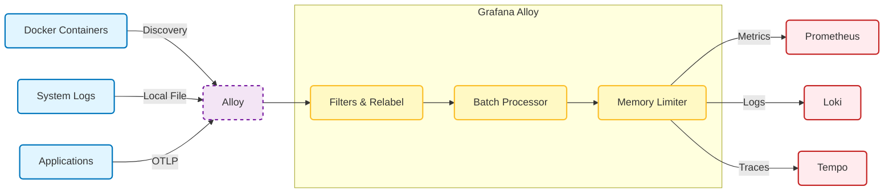

# 🚀 Grafana Alloy Configuration Guide

## 📋 Tổng quan

**Grafana Alloy** là "bộ não" thu thập telemetry (Metrics, Logs, Traces) của toàn hệ thống. Nó thay thế cho các agent rời rạc trước đây như Promtail và OpenTelemetry Collector.

### Tại sao dùng Alloy?
*   **Unified Agent**: Chỉ cần chạy 1 binary cho mọi loại dữ liệu.
*   **Pipeline Processing**: Cho phép lọc, sửa đổi, thêm nhãn dữ liệu trước khi gửi đi.
*   **OTLP Native**: Hỗ trợ chuẩn OpenTelemetry.

---

## 🏗️ Architecture Pipeline

Alloy hoạt động theo nguyên tắc **Components Pipeline**:
`Receiver -> Processor -> Exporter`



---

## ⚙️ Chi tiết Cấu hình (`config.alloy`)

File cấu hình tại `grafana-prometheus/alloy/config.alloy`. Dưới đây là giải thích chi tiết các pipeline chính.

### 1. Docker Log Pipeline (Thay thế Promtail)

Alloy tự động phát hiện container mới và thu thập logs.

```alloy
// 1. Discovery
discovery.docker "containers" {
  host = "unix:///var/run/docker.sock"
}

// 2. Relabeling (Làm sạch Labels)
discovery.relabel "docker_logs" {
  targets = discovery.docker.containers.targets
  
  // Drop logs của chính monitoring system (tránh loops)
  rule {
    source_labels = ["__meta_docker_container_name"]
    regex         = ".*(loki|alloy).*"
    action        = "drop"
  }
  
  // Extract Service Name từ Docker Labels
  rule {
    source_labels = ["__meta_docker_container_label_com_docker_compose_service"]
    target_label  = "service"
  }
}

// 3. Forward to Loki
loki.source.docker "containers" {
  targets    = discovery.relabel.docker_logs.output
  forward_to = [loki.process.docker_logs.receiver]
}
```

### 2. OTLP Pipeline (Thay thế OTel Collector)

Nhận data từ ứng dụng qua port 4317 (gRPC) và 4318 (HTTP).

```alloy
// 1. Receiver
otelcol.receiver.otlp "default" {
  grpc { endpoint = "0.0.0.0:4317" }
  http { endpoint = "0.0.0.0:4318" }
  
  output {
    metrics = [otelcol.processor.memory_limiter.default.input]
    traces  = [otelcol.processor.memory_limiter.default.input]
    logs    = [otelcol.processor.memory_limiter.default.input]
  }
}

// 2. Processors (Bảo vệ memory & Gom Batch)
otelcol.processor.memory_limiter "default" {
  limit = "400MiB"  // Nếu RAM dùng > 400MB, sẽ drop data để tránh crash
}

otelcol.processor.batch "default" {
  send_batch_size = 8192
  timeout         = "5s"
}

// 3. Exporters (Đẩy đi đâu?)
otelcol.exporter.prometheus "otlp_metrics" {
  forward_to = [prometheus.remote_write.otlp_metrics.receiver]
}

otelcol.exporter.loki "otlp_logs" {
  forward_to = [loki.write.default.receiver]
}

otelcol.exporter.otlp "tempo" {
  client { endpoint = "tempo:4317" }
}
```

---

## 🔧 Hướng dẫn Vận hành

### 1. Debugging Pipeline
Truy cập UI của Alloy để xem sơ đồ pipeline đang chạy:
*   URL: `http://localhost:12345` (xem file `docker-compose.monitor.yml` nếu port khác)
*   Tại đây bạn có thể thấy component nào đang errors, component nào đang dropping data.

### 2. Thêm target mới (Ví dụ: Log file custom)
Muốn Alloy đọc thêm file `/var/log/myapp.log`, thêm đoạn sau vào `config.alloy`:

```alloy
local.file_match "myapp_log" {
  path_targets = [{
    __path__ = "/var/log/myapp.log",
    job      = "myapp",
  }]
}

loki.source.file "myapp" {
  targets    = local.file_match.myapp_log.targets
  forward_to = [loki.write.default.receiver]
}
```

### 3. Performance Tuning
Nếu Alloy chiếm quá nhiều CPU/RAM:
*   Giảm `refresh_interval` trong discovery (mặc định 5s -> sửa thành 30s).
*   Tăng `spike_limit` trong memory limiter.
*   Log logic quá phức tạp (Regex) -> chuyển bớt logic sang Loki (dùng LogQL lúc query).

---

## 📚 Tài liệu tham khảo
*   [Alloy Standard Library](https://grafana.com/docs/alloy/latest/reference/stdlib/)
*   [Docker Discovery](https://grafana.com/docs/alloy/latest/reference/components/discovery/discovery.docker/)
*   [OTLP Receiver](https://grafana.com/docs/alloy/latest/reference/components/otelcol/otelcol.receiver.otlp/)
