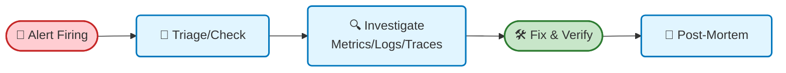

# 🚨 Quy trình Xử lý Sự cố & Vận hành (Incident Response)

Tài liệu này mô tả quy trình phản ứng nhanh khi hệ thống Monitoring phát cảnh báo, sử dụng công cụ trong **LGTM Stack**.

## 🔄 1. Incident Workflow

### SLA Phản hồi (Response Times)
*   **P1 (Critical)**: Hệ thống "sập" hoàn toàn (Website down, DB chết). Phản hồi: **< 15 phút**.
*   **P2 (High)**: Tính năng chính lỗi, Performance giảm nghiêm trọng. Phản hồi: **< 1 giờ**.
*   **P3 (Medium)**: Lỗi nhỏ, không ảnh hưởng core flow. Phản hồi: **Trong ngày**.

---

## 🛠️ 2. Troubleshooting Guide (Hướng dẫn Điều tra)

Khi nhận được Alert, hãy thực hiện theo các bước sau trong Grafana.

### Bước 1: Xác nhận vấn đề (Metrics)
*   Mở **Alertmanager Dashboard** hoặc click link trong alert Telegram.
*   Xác định Scope: 
    *   Toàn bộ hệ thống bị? -> Check **Node Exporter**.
    *   Chỉ 1 service bị? -> Check **RED Metrics**.
    *   DB bị? -> Check **MongoDB/Postgres Overview**.

### Bước 2: Tìm nguyên nhân (Traces & Logs)
Sử dụng triết lý **LGTM** (Loki - Grafana - Tempo - Mimir).

1.  **Từ Metrics qua Traces**:
    *   Trong Dashboard RED Metrics, tìm điểm gãy (Spike latency hoặc Error đột biến).
    *   Click vào **Exemplars** (các chấm trên biểu đồ) để nhảy sang **Tempo Trace**.
    *   Phân tích **Waterfall View** để xem Span nào chậm (DB query lâu? External API timeout?).

2.  **Từ Traces qua Logs**:
    *   Từ Trace ID, query sang **Loki** để xem logs chi tiết của request đó.
    *   Kiểm tra Stack Trace trong log để thấy lỗi dòng code cụ thể.

### Bước 3: Fix & Validate
*   Sau khi deploy fix, quan sát lại Metrics trong 15-30 phút.
*   Đảm bảo Alert chuyển sang trạng thái **RESOLVED**.

---

## 📘 3. Common Runbooks (Sổ tay Xử lý nhanh)

### 🔥 Kịch bản 1: High Error Rate (> 5%)
**Triệu chứng:** Người dùng báo lỗi 500 liên tục. Alert `NginxHighHttp5xxErrorRate` bắn.

**Hành động:**
1.  Mở Dashboard **RED Metrics**.
2.  Lọc service có error cao nhất.
3.  Query Logs (Loki): `{service_name="backend"} |= "error"`.
4.  Nếu thấy lỗi DB Connection -> Check Dashboard DB (Max Connections?).
5.  Nếu thấy lỗi Code Logic -> Rollback bản deploy gần nhất.

### 🐢 Kịch bản 2: High Latency (Web chậm)
**Triệu chứng:** Alert `NginxLatencyHigh` hoặc `SlowEndpointDetected`.

**Hành động:**
1.  Mở Dashboard **Nginx Exporter** để xem endpoint nào chậm.
2.  Mở Dashboard **Tempo Service Graph** để xem service nào nghẽn cổ chai.
3.  Tìm Trace mẫu: `duration > 5s`.
4.  Nếu thấy span `db_query` chiếm 90% thời gian -> Check **Slow Query Log** trong Dashboard DB Logs.

### 💾 Kịch bản 3: Disk Full
**Triệu chứng:** Alert `HostOutOfDiskSpace`.

**Hành động:**
1.  SSH vào server.
2.  Chạy `docker system df` xe Docker có ăn disk không -> `docker system prune`.
3.  Kiểm tra log file cũ: `du -sh /var/log/*`.
4.  **Lưu ý**: Grafana Alloy/Loki lưu data trong MinIO/Volume, kiểm tra retention policy nếu disk đầy thường xuyên.

### 🔌 Kịch bản 4: Grafana Alloy Down
**Triệu chứng:** Alert `AlloyDown`. Mất toàn bộ logs và metrics mới.

**Hành động:**
1.  SSH vào server monitoring.
2.  Check container: `docker ps | grep alloy`.
3.  Xem log Alloy: `docker logs alloy`.
4.  Restart: `docker restart alloy`.

---

## 🧹 4. Maintenance (Bảo trì định kỳ)

### Hàng ngày
*   Kiểm tra kênh Alert Telegram lúc 9:00 sáng. Đảm bảo không có alert dạng "Firing" treo qua đêm.

### Hàng tháng
*   Review lại các Alert Rules: Tắt các alert gây nhiễu (False Positive).
*   Kiểm tra dung lượng Disk của Loki/Prometheus (Retention Policy).
*   Test backup Dashboards (Export JSON).

### Quy trình Backup Dashboard
Dashboards được lưu tại `grafana/provisioning/dashboards`.
*   **KHÔNG** sửa trực tiếp trên UI rồi để đó (sẽ mất khi restart).
*   Sau khi sửa trên UI -> Save JSON -> Commit vào Git repo.
