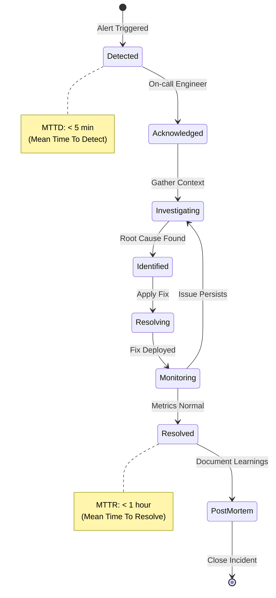
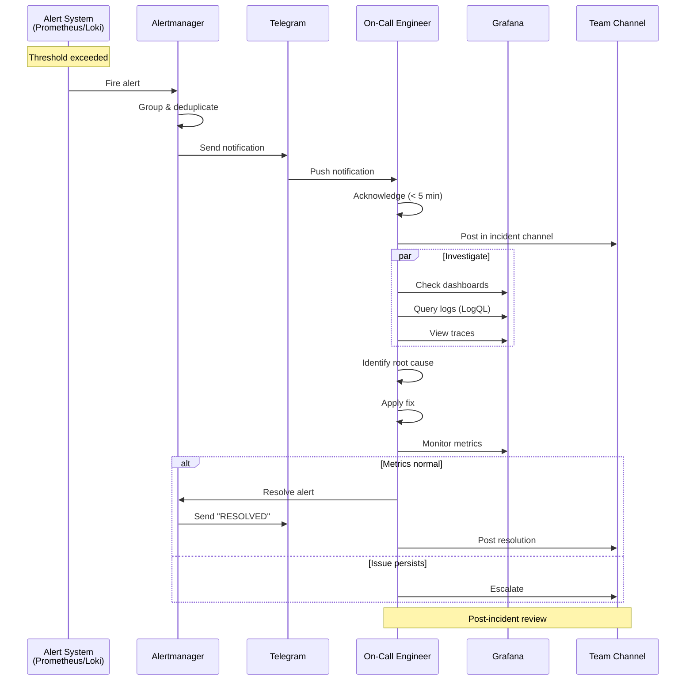
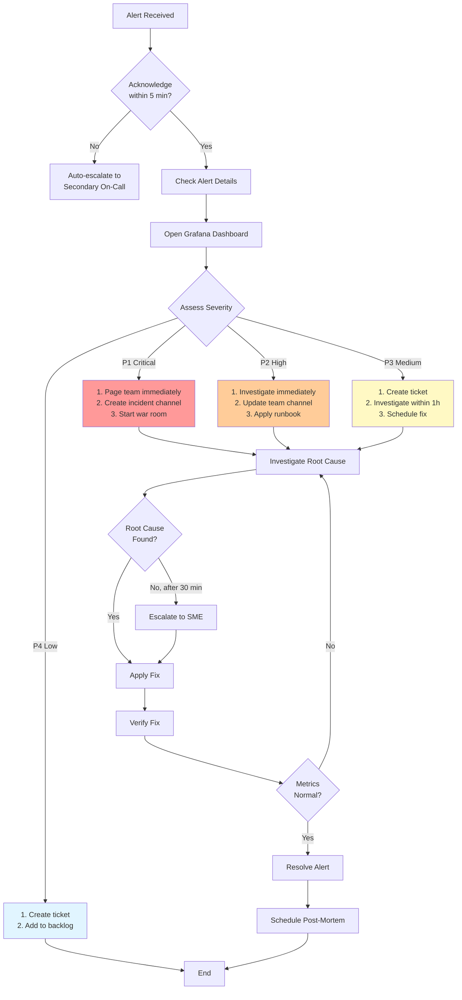
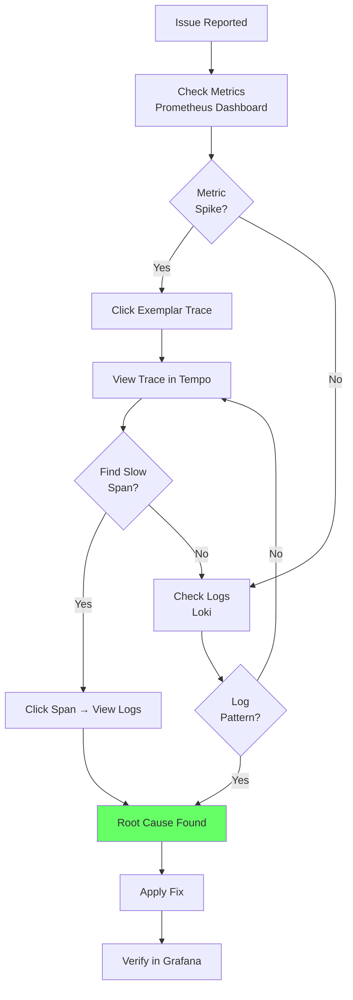

# QUY TRÌNH XỬ LÝ SỰ CỐ VÀ VẬN HÀNH

> **Tài liệu này mô tả quy trình xử lý sự cố, runbooks, và best practices vận hành hệ thống monitoring**

## 📋 Mục lục

- [1. Incident Response Workflow](#1-incident-response-workflow)
- [2. Alert Handling Process](#2-alert-handling-process)
- [3. Runbooks](#3-runbooks)
- [4. Troubleshooting Guide](#4-troubleshooting-guide)
- [5. Maintenance Procedures](#5-maintenance-procedures)

---

## 1. Incident Response Workflow

### 1.1. Incident Lifecycle



### 1.2. Incident Response Process



### 1.3. Severity Levels

| Severity | Description | Response Time | Escalation | Example |
|----------|-------------|---------------|------------|---------|
| **P1 - Critical** | Complete service outage | Immediate | Escalate after 15 min | API down, Database unreachable |
| **P2 - High** | Partial service degradation | < 15 minutes | Escalate after 1 hour | High error rate (> 5%), Slow response time |
| **P3 - Medium** | Minor issues, workaround available | < 1 hour | Escalate after 4 hours | Non-critical feature broken |
| **P4 - Low** | Cosmetic issues, no impact | Next business day | No escalation | Dashboard typo, Minor UI glitch |

### 1.4. Incident Roles

**Incident Commander (IC)**:
- Overall incident coordination
- Decision making authority
- Communication with stakeholders

**On-Call Engineer**:
- First responder
- Technical investigation
- Implement fixes

**Communication Lead**:
- Update status page
- Notify customers
- Coordinate with IC

**Subject Matter Expert (SME)**:
- Deep technical knowledge
- Consulted for complex issues

---

## 2. Alert Handling Process

### 2.1. Alert Triage Workflow



### 2.2. Alert Response Checklist

**When Alert Fires**:

- [ ] **Acknowledge** alert within 5 minutes
- [ ] **Check** Grafana dashboard for context
- [ ] **Assess** severity (P1-P4)
- [ ] **Notify** team in appropriate channel
- [ ] **Document** initial observations

**During Investigation**:

- [ ] **Correlate** metrics, logs, traces
- [ ] **Check** recent deployments/changes
- [ ] **Review** similar past incidents
- [ ] **Test** hypothesis
- [ ] **Update** team on progress (every 15 min for P1)

**After Resolution**:

- [ ] **Verify** metrics returned to normal
- [ ] **Resolve** alert in Alertmanager
- [ ] **Document** root cause and fix
- [ ] **Update** runbook if needed
- [ ] **Schedule** post-mortem (P1, P2)

---

## 3. Runbooks

### 3.1. Runbook Template

```markdown
# Runbook: [Alert Name]

## Alert Details
- **Alert Name**: `[alert_name]`
- **Severity**: P[1-4]
- **Threshold**: [condition]
- **Dashboard**: [Grafana dashboard link]

## Symptoms
- What the user experiences
- What metrics show

## Possible Causes
1. Cause A (most common)
2. Cause B
3. Cause C

## Investigation Steps
1. Check [metric/log]
2. Verify [component]
3. Review [dashboard]

## Resolution Steps
### If Cause A:
1. Step 1
2. Step 2

### If Cause B:
1. Step 1
2. Step 2

## Escalation
- Escalate to: [SME name/team]
- After: [time threshold]

## Prevention
- Long-term fix
- Monitoring improvements
```

### 3.2. Common Runbooks

#### Runbook 1: High CPU Usage

```yaml
Alert: HighCPUUsage
Severity: P2
Threshold: CPU > 80% for 5 minutes
Dashboard: http://grafana:3000/d/node-exporter
```

**Symptoms**:
- Slow API response times
- High load average
- Application timeouts

**Investigation**:
```bash
# 1. Check which process consuming CPU
ssh <server>
top -o %CPU

# 2. Check CPU metrics in Grafana
# Query: 100 - (avg by(instance) (rate(node_cpu_seconds_total{mode="idle"}[5m])) * 100)

# 3. Check application logs
# LogQL: {job="app"} |= "error" | json | __error__=""
```

**Resolution**:

**If application process**:
```bash
# Check for infinite loops, memory leaks
# Restart application
docker restart <container>
```

**If database query**:
```bash
# Check slow queries in PostgreSQL
SELECT * FROM pg_stat_activity WHERE state = 'active' AND query_start < NOW() - INTERVAL '5 minutes';

# Kill long-running query
SELECT pg_terminate_backend(pid);
```

**Prevention**:
- Add query timeout
- Optimize slow queries
- Add CPU usage alerts at 70%

---

#### Runbook 2: Disk Space Full

```yaml
Alert: DiskSpaceFull
Severity: P1
Threshold: Disk usage > 90%
Dashboard: http://grafana:3000/d/node-exporter
```

**Symptoms**:
- Application crashes
- Cannot write logs
- Database errors

**Investigation**:
```bash
# 1. Check disk usage
df -h

# 2. Find large files
du -sh /* | sort -hr | head -10

# 3. Check Docker disk usage
docker system df
```

**Resolution**:

**If logs consuming space**:
```bash
# Clean old logs
find /var/log -name "*.log" -mtime +7 -delete

# Rotate logs
logrotate -f /etc/logrotate.conf
```

**If Docker images/containers**:
```bash
# Remove unused images
docker image prune -a -f

# Remove stopped containers
docker container prune -f

# Remove unused volumes
docker volume prune -f
```

**Prevention**:
- Setup log rotation
- Add disk cleanup cron job
- Increase disk size
- Add alert at 80%

---

#### Runbook 3: High Error Rate

```yaml
Alert: HighErrorRate
Severity: P2
Threshold: Error rate > 5% for 5 minutes
Dashboard: http://grafana:3000/d/application
```

**Symptoms**:
- Users seeing 500 errors
- Increased error logs
- Failed transactions

**Investigation**:
```bash
# 1. Check error rate by endpoint
# PromQL: rate(http_requests_total{status=~"5.."}[5m]) / rate(http_requests_total[5m])

# 2. Check error logs
# LogQL: {job="app", level="error"} | json

# 3. Check traces for failed requests
# Tempo: {status = error}
```

**Resolution**:

**If database connection pool exhausted**:
```bash
# Check active connections
# MongoDB: db.serverStatus().connections
# PostgreSQL: SELECT count(*) FROM pg_stat_activity;

# Increase pool size in app config
# Restart application
```

**If external API timeout**:
```bash
# Check external API health
curl -w "@curl-format.txt" https://external-api.com/health

# Implement circuit breaker
# Add retry logic
```

**Prevention**:
- Add connection pool monitoring
- Implement circuit breaker pattern
- Add timeout configuration
- Setup external API monitoring

---

#### Runbook 4: Database Slow Queries

```yaml
Alert: DatabaseSlowQueries
Severity: P2
Threshold: Query duration > 1s
Dashboard: http://grafana:3000/d/postgresql
```

**Symptoms**:
- Slow API responses
- Database CPU high
- Connection pool exhausted

**Investigation**:

**PostgreSQL**:
```sql
-- Check slow queries
SELECT pid, now() - query_start AS duration, query
FROM pg_stat_activity
WHERE state = 'active' AND now() - query_start > interval '1 second'
ORDER BY duration DESC;

-- Check table statistics
SELECT schemaname, tablename, seq_scan, idx_scan
FROM pg_stat_user_tables
WHERE seq_scan > idx_scan
ORDER BY seq_scan DESC;
```

**MongoDB**:
```javascript
// Enable profiling
db.setProfilingLevel(2)

// Check slow queries
db.system.profile.find({millis: {$gt: 1000}}).sort({ts: -1}).limit(10)

// Check indexes
db.collection.getIndexes()
```

**Resolution**:

**If missing index**:
```sql
-- PostgreSQL
CREATE INDEX idx_users_email ON users(email);

-- MongoDB
db.users.createIndex({email: 1})
```

**If N+1 query problem**:
```javascript
// Use JOIN instead of multiple queries
// PostgreSQL
SELECT u.*, o.* FROM users u LEFT JOIN orders o ON u.id = o.user_id;

// MongoDB
db.users.aggregate([
  {$lookup: {from: "orders", localField: "_id", foreignField: "user_id", as: "orders"}}
])
```

**Prevention**:
- Add query performance monitoring
- Regular index optimization
- Code review for N+1 queries
- Add query timeout

---

## 4. Troubleshooting Guide

### 4.1. Debugging Workflow



### 4.2. Common Issues & Solutions

#### Issue 1: "No Data" in Grafana Dashboard

**Symptoms**:
- Dashboard shows "No Data"
- Queries return empty results

**Troubleshooting**:
```bash
# 1. Check Prometheus targets
curl http://prometheus:9090/api/v1/targets | jq '.data.activeTargets[] | select(.health != "up")'

# 2. Check if metrics exist
curl http://prometheus:9090/api/v1/query?query=up

# 3. Check time range in Grafana
# Make sure time range includes data

# 4. Check datasource connection
# Grafana → Configuration → Data Sources → Test
```

**Resolution**:
- Fix down targets (check exporter, firewall)
- Adjust time range
- Verify datasource configuration

---

#### Issue 2: Alert Fatigue (Too Many Alerts)

**Symptoms**:
- Receiving 50+ alerts per day
- Many false positives
- Team ignoring alerts

**Troubleshooting**:
```bash
# 1. Check alert frequency
# Alertmanager UI → Alerts → Group by alert name

# 2. Analyze alert patterns
# Which alerts fire most often?
# Which alerts are false positives?
```

**Resolution**:
```yaml
# Adjust thresholds
# Before:
- alert: HighCPU
  expr: cpu_usage > 70%
  for: 1m

# After:
- alert: HighCPU
  expr: cpu_usage > 80%
  for: 5m  # Increase duration
```

**Prevention**:
- Weekly alert review
- Tune thresholds based on baselines
- Add inhibition rules
- Use alert severity levels

---

#### Issue 3: Logs Not Appearing in Loki

**Symptoms**:
- Logs not visible in Grafana
- LogQL queries return no results

**Troubleshooting**:
```bash
# 1. Check Loki is receiving logs
curl http://loki:3100/metrics | grep loki_ingester_streams_created_total

# 2. Check Promtail is running
docker ps | grep promtail

# 3. Check Promtail logs
docker logs promtail

# 4. Test push to Loki
curl -X POST http://loki:3100/loki/api/v1/push \
  -H "Content-Type: application/json" \
  -d '{"streams":[{"stream":{"job":"test"},"values":[["'$(date +%s)000000000'","test message"]]}]}'
```

**Resolution**:
- Fix Promtail configuration
- Check firewall (port 3100)
- Verify label names (no special characters)
- Check Loki retention settings

---

## 5. Maintenance Procedures

### 5.1. Daily Checks

**Morning Health Check** (10 minutes):

```bash
# 1. Check all services running
docker compose ps

# 2. Check Prometheus targets
curl -s http://prometheus:9090/api/v1/targets | jq '.data.activeTargets | map(select(.health != "up")) | length'
# Expected: 0

# 3. Check disk usage
df -h | grep -E '(9[0-9]|100)%'
# Expected: empty

# 4. Check alert count
curl -s http://alertmanager:9093/api/v2/alerts | jq 'length'
# Expected: < 5
```

### 5.2. Weekly Maintenance

**Every Monday** (30 minutes):

- [ ] Review alert frequency (top 10 alerts)
- [ ] Check disk usage trends
- [ ] Review slow queries (database)
- [ ] Update runbooks based on last week's incidents
- [ ] Check for Grafana dashboard updates

### 5.3. Monthly Maintenance

**First Monday of Month** (2 hours):

- [ ] Review retention policies
- [ ] Clean up old data (if needed)
- [ ] Update exporters to latest versions
- [ ] Review and optimize alert rules
- [ ] Capacity planning (disk, CPU, memory trends)
- [ ] Backup Grafana dashboards
- [ ] Test disaster recovery

### 5.4. Backup Procedures

**Grafana Dashboards**:
```bash
# Export all dashboards
for dash in $(curl -s -H "Authorization: Bearer $GRAFANA_API_KEY" \
  http://grafana:3000/api/search | jq -r '.[].uid'); do
  curl -s -H "Authorization: Bearer $GRAFANA_API_KEY" \
    http://grafana:3000/api/dashboards/uid/$dash | jq . > dashboard_$dash.json
done
```

**Prometheus Data**:
```bash
# Snapshot Prometheus data
docker exec prometheus promtool tsdb snapshot /prometheus
```

**Alert Rules**:
```bash
# Backup alert rules
cp -r /opt/monitor-repo/grafana-prometheus/prometheus/rules.*.yml /backup/
```

---

## 📚 Tài liệu Liên quan

- **[DEPLOYMENT.md](./DEPLOYMENT.md)** - Hướng dẫn triển khai
- **[SOLUTION_ANALYSIS.md](./SOLUTION_ANALYSIS.md)** - Phân tích vấn đề và lựa chọn giải pháp
- **[NETWORK_ARCHITECTURE.md](./NETWORK_ARCHITECTURE.md)** - Kiến trúc mạng

---

**Version**: 1.0.0  
**Last Updated**: 2026-01-09  
**Maintainer**: DevOps Team
