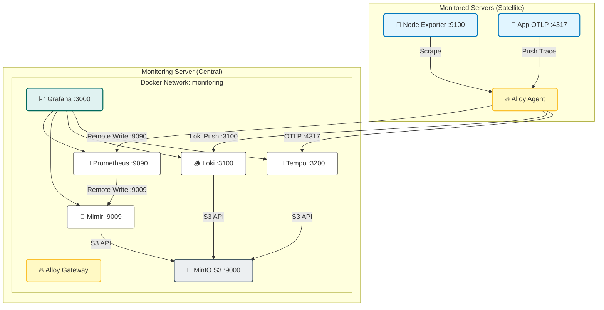
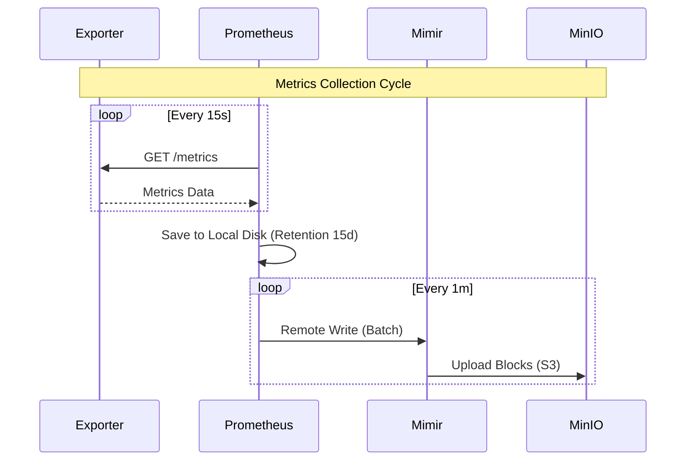

# KIẾN TRÚC MẠNG VÀ LUỒNG DỮ LIỆU (UPDATED)

> **Tài liệu này mô tả chi tiết hạ tầng mạng, các luồng dữ liệu (Data Flow) trong LGTM Stack và vai trò của Grafana Alloy.**

## 📋 Mục lục

- [1. Tổng quan Kiến trúc Mạng](#1-tổng-quan-kiến-trúc-mạng)
- [2. Luồng Dữ liệu Chi tiết](#2-luồng-dữ-liệu-chi-tiết)
- [3. Service Discovery](#3-service-discovery)
- [4. Storage & Retention](#4-storage--retention)

---

## 1. Tổng quan Kiến trúc Mạng

### 1.1. Network Topology

Hệ thống giám sát tập trung tại một Server (Monitoring Server), thu thập dữ liệu từ các Server vệ tinh (Monitored Servers) thông qua mạng nội bộ.



### 1.2. Port Matrix (Bảng Port quan trọng)

| Service | Port | Protocol | Mô tả |
|---------|------|----------|-------|
| **Grafana UI** | 3000 | HTTP | Giao diện quản trị. |
| **Alloy UI** | 12345 | HTTP | Debug Pipeline của Agent. |
| **Prometheus** | 9090 | HTTP | Query metrics ngắn hạn. |
| **Mimir** | 9009 | HTTP | Query metrics dài hạn (Remote Write target). |
| **Loki** | 3100 | HTTP | Ingestion & Query Logs. |
| **Tempo** | 3200 | HTTP | Query Traces. |
| **Tempo OTLP** | 4317 | gRPC | Nhận Traces từ App/Agent. |
| **MinIO API** | 9000 | HTTP | S3-compatible API. |
| **MinIO UI** | 9001 | HTTP | Giao diện quản lý Bucket. |
| **Alertmanager** | 9093 | HTTP | Cổng nhận Alert. |
| **Blackbox** | 9115 | HTTP | Probe endpoints. |

---

## 2. Luồng Dữ liệu Chi tiết

### 2.1. Metrics Flow (Hybrid Pull/Push)
Hệ thống kết hợp cả Pull (Prometheus truyền thống) và Push (cho Long-term storage).

1.  **Collection**: Alloy (hoặc Prometheus) scrape metrics từ các Exporter (Node, Mongo, Postgres) mỗi 15s.
2.  **Ingestion**: Metrics được ghi vào **Prometheus** (Local TSDB) để phục vụ alert và query nhanh.
3.  **Long-term Archiving**: Prometheus đẩy (Remote Write) dữ liệu sang **Mimir**.
4.  **Persistence**: Mimir lưu các block dữ liệu vào **MinIO** (S3).



### 2.2. Logs Flow (Pipeline Processing)
Sử dụng Grafana Alloy làm bộ thu thập log duy nhất.

1.  **Discovery**: Alloy tự động tìm các Container Docker đang chạy.
2.  **Extraction**: Alloy đọc file JSON log từ `/var/lib/docker/containers/...`.
3.  **Processing**: Alloy lọc bỏ log rác, mask dữ liệu nhạy cảm (nếu cấu hình).
4.  **Push**: Alloy gửi log đã xử lý tới **Loki**.
5.  **Storage**: Loki nén log và lưu vào **MinIO**.

### 2.3. Traces Flow (End-to-End OTLP)
Flow này cho phép nhìn thấy toàn bộ hành trình của request.

1.  **Instrumentation**: App (NestJS) dùng OTel SDK để sinh trace.
2.  **Export**: App bắn trace về **Alloy** (localhost:4317).
3.  **Forward**: Alloy chuyển tiếp trace về **Tempo Gateway** (Monitor Server).
4.  **Analysis**: Tempo lưu trace vào MinIO, đồng thời tính toán "Span Metrics" (RED Method) gửi ngược lại Prometheus.

---

## 3. Service Discovery

Thay vì config IP tĩnh thủ công, chúng ta sử dụng **File-Based Service Discovery**.

*   Cấu trúc thư mục:
    ```
    grafana-prometheus/prometheus/targets/
    ├── node.json           # List server vật lý
    ├── postgres.json       # List DB
    └── blackbox.json       # List website cần ping
    ```
*   **Cơ chế**: Prometheus watch thư mục này. Khi bạn sửa file JSON, Prometheus tự reload **ngay lập tức** không cần restart.

---

## 4. Storage & Retention

Dữ liệu được phân tầng để tối ưu chi phí và hiệu năng.

| Loại dữ liệu | Lưu tại | Retention (Thời gian lưu) | Backend |
|--------------|---------|---------------------------|---------|
| **Metrics (Hot)** | Prometheus | 15 ngày | Local Disk (SSD) |
| **Metrics (Cold)** | Mimir | **390 ngày** (~1 năm) | MinIO (S3) |
| **Logs** | Loki | 30 ngày | MinIO (S3) |
| **Traces** | Tempo | 7 ngày | MinIO (S3) |

*   **MinIO**: Là trái tim của hệ thống lưu trữ. Tất cả dữ liệu dài hạn đều nằm ở đây. Bạn chỉ cần backup folder `minio-data` là an toàn.

---

## 5. Kết nối Mạng (Firewall Rules)

Nếu triển khai trên môi trường có Firewall, cần mở các port sau:

*   **Từ Admin PC -> Monitor Server**: 3000 (Grafana), 9001 (MinIO UI).
*   **Từ Monitor Server -> Satellite Servers**: 9100 (Node Exporter), 22 (SSH).
*   **Từ Satellite Servers -> Monitor Server**: 3100 (Loki), 4317 (Tempo), 9009 (Mimir).

> **Note**: Các port database (5432, 27017) KHÔNG cần public internet, chỉ cần Monitor Server truy cập được trong LAN/VPN.
