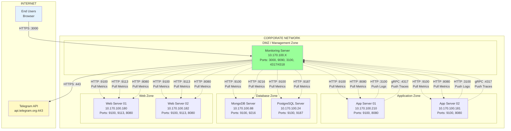
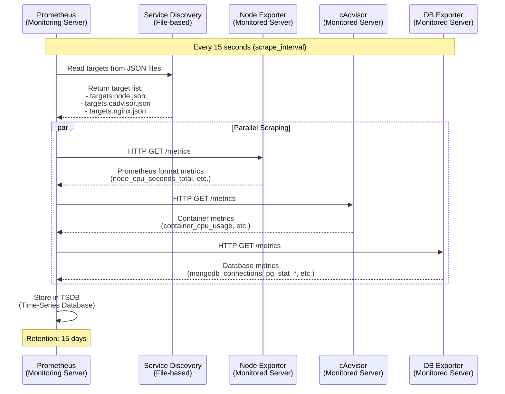
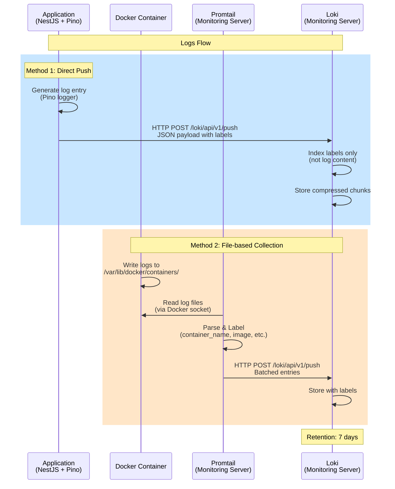
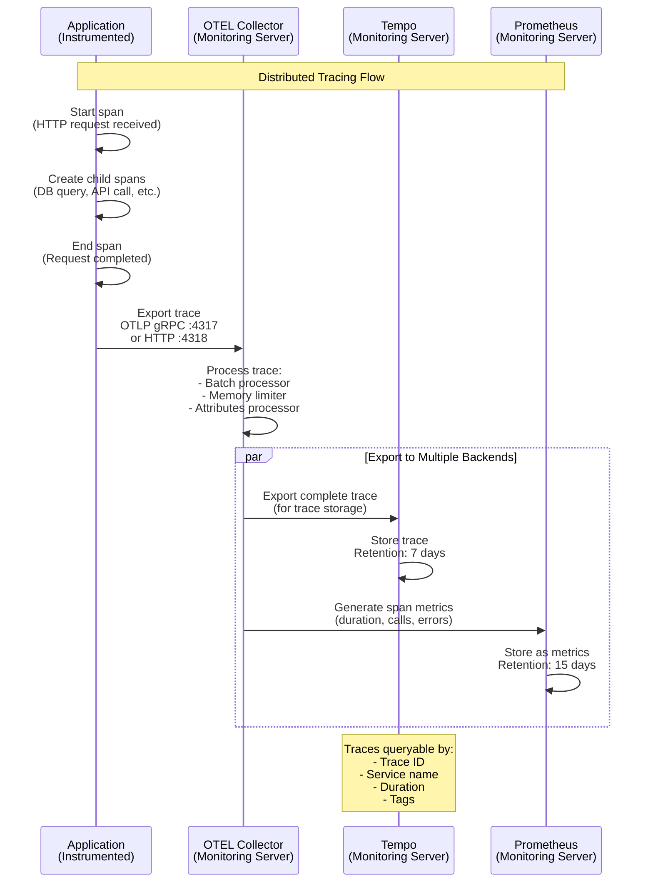
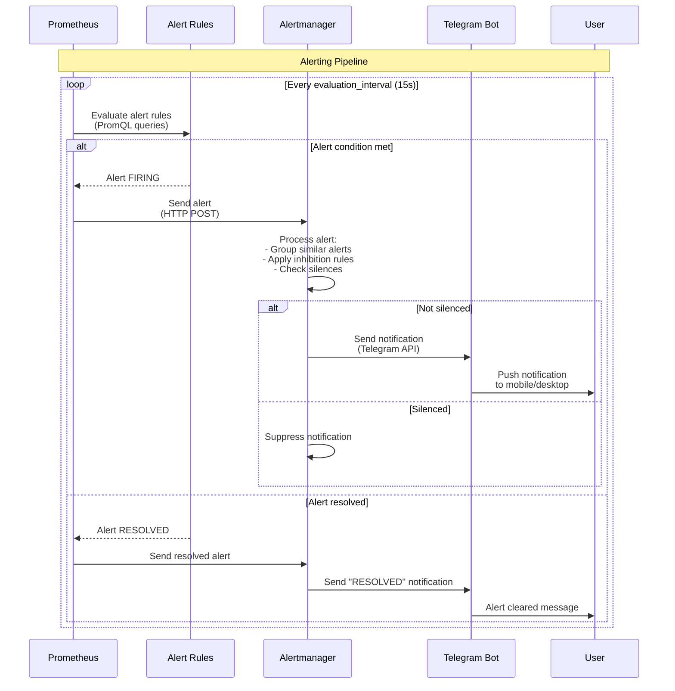
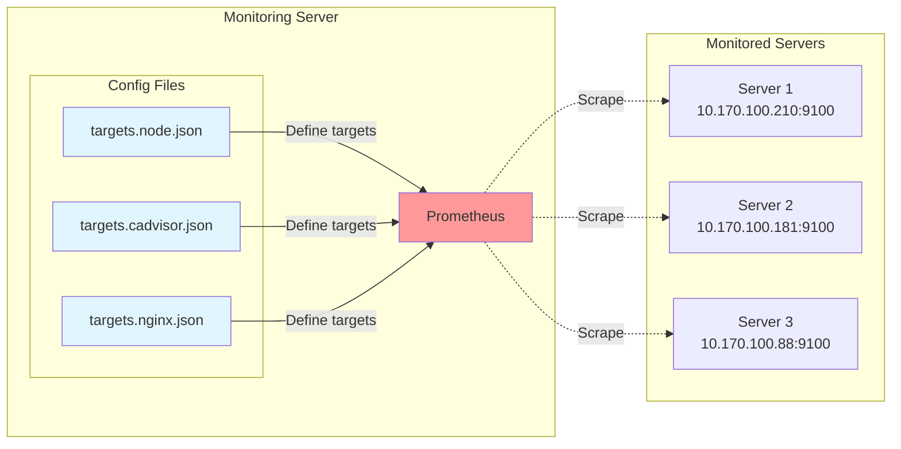
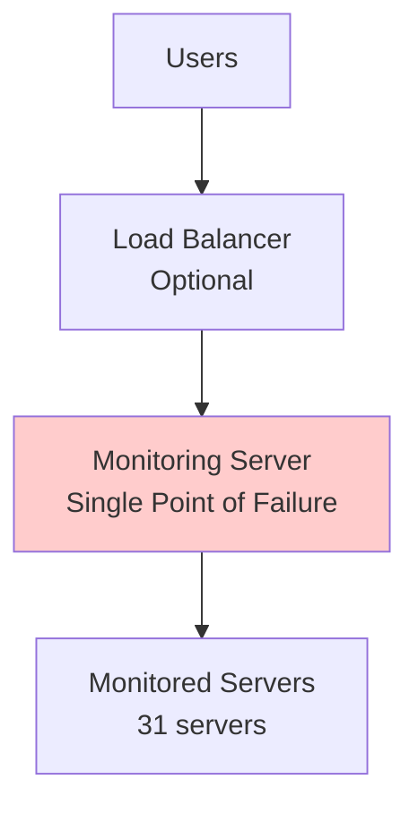
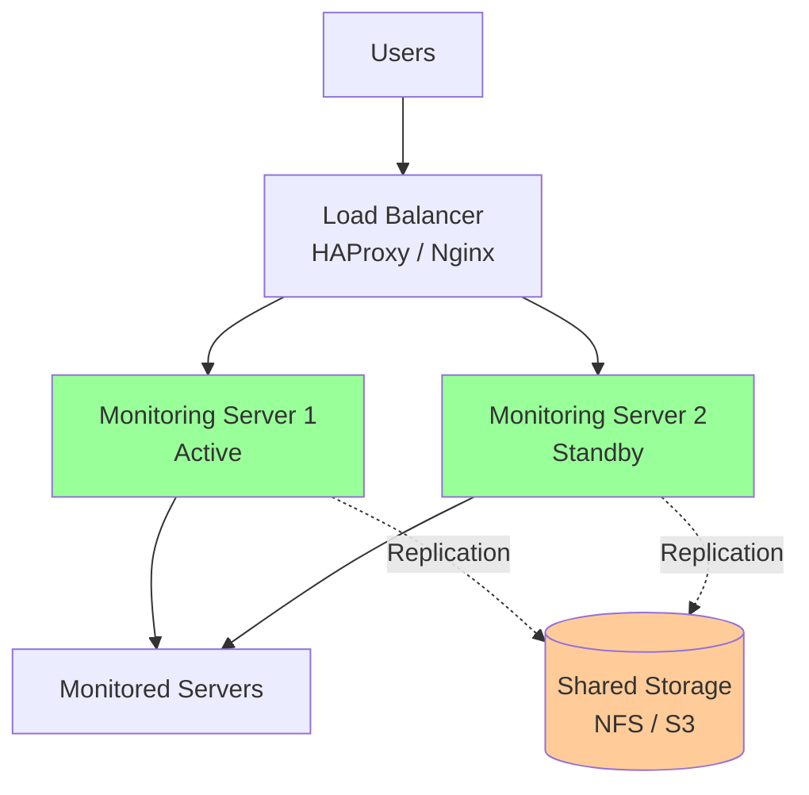

# KIẾN TRÚC MẠNG VÀ LUỒNG DỮ LIỆU

> **Tài liệu này mô tả chi tiết về kiến trúc mạng, luồng dữ liệu, và cơ chế hoạt động của hệ thống monitoring**

## 📋 Mục lục

- [1. Tổng quan Kiến trúc Mạng](#1-tổng-quan-kiến-trúc-mạng)
- [2. Luồng Dữ liệu Chi tiết](#2-luồng-dữ-liệu-chi-tiết)
- [3. Service Discovery](#3-service-discovery)
- [4. Data Retention và Storage](#4-data-retention-và-storage)
- [5. High Availability Considerations](#5-high-availability-considerations)

---

## 1. Tổng quan Kiến trúc Mạng

### 1.1. Network Topology



### 1.2. Port Matrix

| Service | Monitoring Server | Monitored Servers | Direction | Protocol |
|---------|-------------------|-------------------|-----------|----------|
| **Grafana UI** | :3000 | - | Inbound | HTTP/HTTPS |
| **Prometheus API** | :9090 | - | Inbound | HTTP |
| **Loki Push** | :3100 | - | Inbound | HTTP |
| **OTEL gRPC** | :4317 | - | Inbound | gRPC |
| **OTEL HTTP** | :4318 | - | Inbound | HTTP |
| **Alertmanager** | :9093 | - | Inbound | HTTP |
| **Node Exporter** | - | :9100 | Outbound | HTTP |
| **cAdvisor** | - | :8080 | Outbound | HTTP |
| **Nginx Exporter** | - | :9113 | Outbound | HTTP |
| **MongoDB Exporter** | - | :9216 | Outbound | HTTP |
| **PostgreSQL Exporter** | - | :9187 | Outbound | HTTP |

---

## 2. Luồng Dữ liệu Chi tiết

### 2.1. Metrics Collection Flow (Pull Model)



**Chi tiết từng bước**:

1. **Service Discovery**: Prometheus đọc file JSON mỗi 30s (mặc định)
2. **Target Selection**: Prometheus chọn targets cần scrape dựa trên schedule
3. **HTTP Request**: Gửi `GET /metrics` đến exporter
4. **Response Parsing**: Parse Prometheus format metrics
5. **Storage**: Lưu vào TSDB với timestamp
6. **Compression**: Compress data theo blocks (2h)

### 2.2. Logs Collection Flow (Push Model)



**Loki Label Strategy**:

```json
{
  "streams": [
    {
      "stream": {
        "job": "nestjs-app",
        "environment": "production",
        "host": "app-01",
        "level": "error",
        "service": "api"
      },
      "values": [
        ["1704844800000000000", "Error message here"]
      ]
    }
  ]
}
```

### 2.3. Traces Collection Flow (Push Model)



**Trace Structure**:

```
Trace ID: abc-123-def-456
├─ Span: HTTP GET /api/orders (200ms)
│  ├─ Span: Auth middleware (10ms)
│  ├─ Span: Database query (150ms)
│  │  └─ Span: PostgreSQL SELECT (145ms)
│  └─ Span: Response serialization (40ms)
```

### 2.4. Alerting Flow



**Alert Example**:

```yaml
# High CPU Alert
- alert: HighCPUUsage
  expr: 100 - (avg by(instance) (rate(node_cpu_seconds_total{mode="idle"}[5m])) * 100) > 80
  for: 5m
  labels:
    severity: warning
  annotations:
    summary: "High CPU on {{ $labels.instance }}"
    description: "CPU usage is {{ $value }}%"
```

---

## 3. Service Discovery

### 3.1. File-based Service Discovery



**Ưu điểm**:
- ✅ Đơn giản, dễ quản lý
- ✅ Không cần external dependencies
- ✅ Tự động reload khi file thay đổi (không cần restart Prometheus)

**Cách thêm target mới**:

```bash
# 1. Edit JSON file
nano /opt/monitor-repo/grafana-prometheus/prometheus/targets.node.json

# 2. Add new target
{
  "targets": [
    "10.170.100.210:9100",
    "10.170.100.NEW_SERVER:9100"  # ← Add here
  ],
  "labels": {
    "job": "node_exporter"
  }
}

# 3. Prometheus auto-reloads (no restart needed)
# Verify in Prometheus UI: Status → Targets
```

### 3.2. Alternative: Consul Service Discovery

> **Lưu ý**: Hiện tại project dùng file-based SD, nhưng có thể migrate sang Consul cho dynamic environments

```yaml
# prometheus.yml (if using Consul)
scrape_configs:
  - job_name: 'node_exporter'
    consul_sd_configs:
      - server: 'consul.example.com:8500'
        services: ['node-exporter']
```

---

## 4. Data Retention và Storage

### 4.1. Storage Architecture

```mermaid
graph TB
    subgraph "Monitoring Server Storage"
        subgraph "Prometheus TSDB"
            PROM_DATA[/prometheus-data/<br/>Metrics Storage<br/>Retention: 15 days<br/>~10-50 GB]
        end
        
        subgraph "Loki Storage"
            LOKI_DATA[/loki-data/<br/>Logs Storage<br/>Retention: 7 days<br/>~5-20 GB]
        end
        
        subgraph "Tempo Storage"
            TEMPO_DATA[/tempo-data/<br/>Traces Storage<br/>Retention: 7 days<br/>~2-10 GB]
        end
        
        subgraph "Grafana Storage"
            GRAFANA_DATA[/grafana-data/<br/>Dashboards, Users<br/>~500 MB]
        end
    end
    
    style PROM_DATA fill:#ff9999
    style LOKI_DATA fill:#ffcc99
    style TEMPO_DATA fill:#cc99ff
    style GRAFANA_DATA fill:#99ff99
```

### 4.2. Disk Usage Estimation

**Công thức ước tính**:

```
Prometheus Storage = (Samples/sec) × (Bytes/sample) × (Retention seconds)
                   = (Metrics × Targets × (1/Scrape interval)) × 2 bytes × Retention

Example:
- 1000 metrics per target
- 30 targets
- 15s scrape interval
- 15 days retention

Storage = (1000 × 30 × (1/15)) × 2 × (15 × 24 × 3600)
        = 2000 samples/sec × 2 bytes × 1,296,000 sec
        ≈ 5.2 GB
```

**Loki Storage**:
```
Loki Storage = (Log rate) × (Avg log size) × (Retention)

Example:
- 100 logs/sec across all sources
- 500 bytes per log
- 7 days retention

Storage = 100 × 500 × (7 × 24 × 3600)
        ≈ 3 GB (compressed ~1 GB)
```

### 4.3. Retention Configuration

**Prometheus** (`docker-compose.yml`):
```yaml
services:
  prometheus:
    command:
      - '--storage.tsdb.retention.time=15d'
      - '--storage.tsdb.retention.size=50GB'  # Optional: size-based
```

**Loki** (`loki-config.yml`):
```yaml
limits_config:
  retention_period: 168h  # 7 days

table_manager:
  retention_deletes_enabled: true
  retention_period: 168h
```

**Tempo** (`tempo-config.yml`):
```yaml
storage:
  trace:
    backend: local
    local:
      path: /var/tempo/traces
    wal:
      path: /var/tempo/wal
    
compactor:
  compaction:
    block_retention: 168h  # 7 days
```

---

## 5. High Availability Considerations

### 5.1. Current Architecture (Single Server)



**Limitations**:
- ❌ Single point of failure
- ❌ No redundancy
- ❌ Downtime during maintenance

### 5.2. Recommended HA Architecture



**HA Components**:

1. **Prometheus HA**:
   ```yaml
   # Run 2 identical Prometheus instances
   # Both scrape same targets
   # Use Thanos/Cortex for deduplication
   ```

2. **Grafana HA**:
   ```yaml
   # Use external database (PostgreSQL)
   # Multiple Grafana instances behind LB
   ```

3. **Loki HA**:
   ```yaml
   # Use object storage (S3, MinIO)
   # Multiple Loki instances
   ```

4. **Alertmanager HA**:
   ```yaml
   # Gossip protocol for clustering
   # Multiple instances auto-discover each other
   ```

### 5.3. Migration Path to HA

**Phase 1**: Add second monitoring server
```bash
# 1. Clone config to server 2
# 2. Start services
# 3. Configure load balancer
```

**Phase 2**: Implement shared storage
```bash
# 1. Setup MinIO / S3
# 2. Migrate Loki to object storage
# 3. Migrate Tempo to object storage
```

**Phase 3**: Add Thanos for Prometheus HA
```bash
# 1. Deploy Thanos Sidecar on each Prometheus
# 2. Deploy Thanos Query for unified view
# 3. Deploy Thanos Store for long-term storage
```

---

## 📊 Performance Benchmarks

### Typical Resource Usage

| Component | CPU (avg) | Memory (avg) | Disk I/O |
|-----------|-----------|--------------|----------|
| Prometheus | 2-4 cores | 4-8 GB | 100-500 MB/s |
| Grafana | 0.5-1 core | 1-2 GB | Low |
| Loki | 1-2 cores | 2-4 GB | 50-200 MB/s |
| Tempo | 1-2 cores | 2-4 GB | 50-150 MB/s |
| OTEL Collector | 0.5-1 core | 1-2 GB | Medium |
| Alertmanager | 0.2-0.5 core | 500 MB | Low |
| Promtail | 0.2-0.5 core | 500 MB | Medium |

### Scalability Limits (Single Server)

- **Max Monitored Servers**: ~100-200 (with 15s scrape interval)
- **Max Metrics/sec**: ~100,000 samples/sec
- **Max Log Ingestion**: ~10,000 logs/sec
- **Max Trace Spans/sec**: ~5,000 spans/sec

> **Lưu ý**: Vượt quá giới hạn này cần migrate sang HA architecture hoặc sharding.

---

**Version**: 1.0.0  
**Last Updated**: 2026-01-09  
**Maintainer**: DevOps Team
