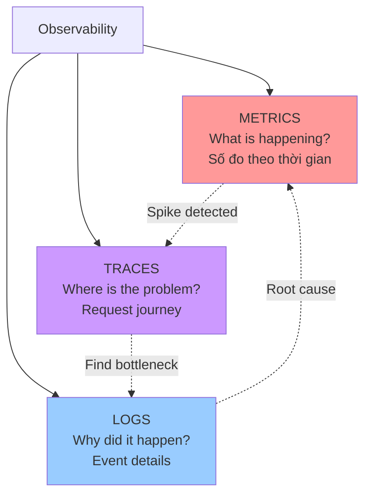
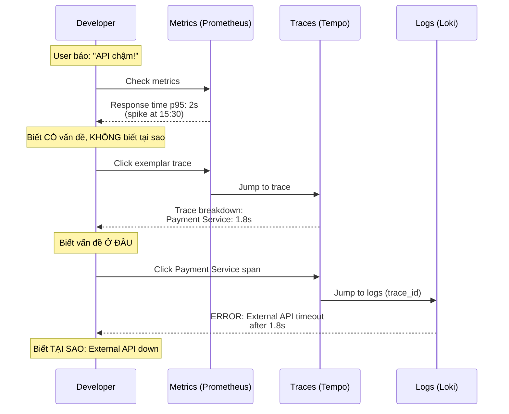
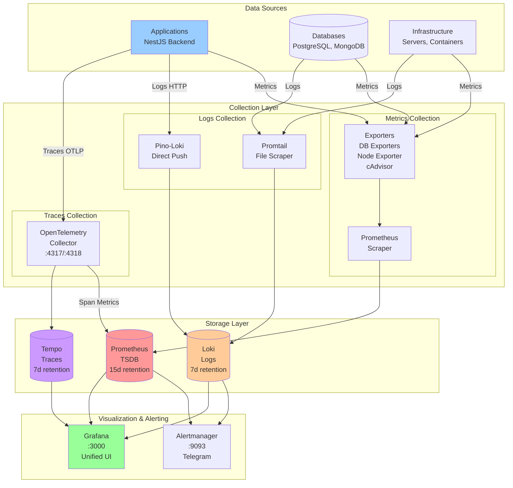
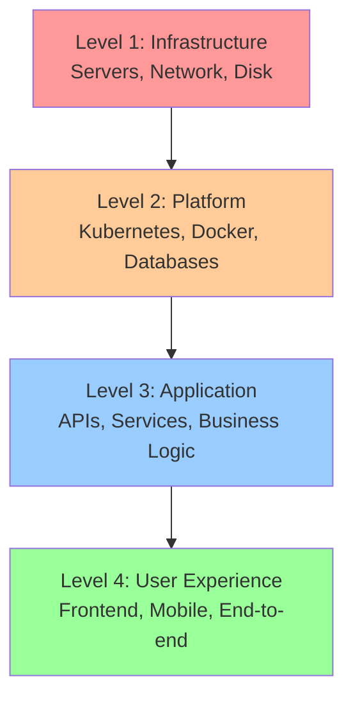

# MONITORING SYSTEM OVERVIEW

## 🎯 Giới thiệu

Hệ thống monitoring này được xây dựng dựa trên **LGTM Stack** (Loki, Grafana, Tempo, Mimir/Prometheus) - một giải pháp observability toàn diện cho việc giám sát ứng dụng và hạ tầng.

### Observability là gì?

**Observability** (khả năng quan sát) là khả năng hiểu được trạng thái nội bộ của hệ thống thông qua các outputs mà nó tạo ra. Khác với monitoring truyền thống (chỉ biết "có vấn đề"), observability giúp bạn **hiểu tại sao** có vấn đề.

### Ba Trụ cột của Observability


```mermaid
graph TB
    O[Observability]
    
    O --> M[METRICS<br/>What is happening?<br/>Số đo theo thời gian]
    O --> T[TRACES<br/>Where is the problem?<br/>Request journey]
    O --> L[LOGS<br/>Why did it happen?<br/>Event details]
    
    M -.->|Spike detected| T
    T -.->|Find bottleneck| L
    L -.->|Root cause| M
    
    style M fill:#ff9999
    style T fill:#cc99ff
    style L fill:#99ccff
```

#### 1. **METRICS** - "Hệ thống đang thế nào?"

**Định nghĩa:** Số đo định lượng theo thời gian (time-series data).

**Ví dụ:**
- CPU usage: 75%
- Request rate: 1000 req/s
- Error rate: 2%
- Response time: 150ms (p95)

**Khi nào dùng:**
- ✅ Phát hiện vấn đề sớm (CPU tăng dần)
- ✅ Alerting (error rate > 5%)
- ✅ Capacity planning (traffic tăng 20%/tháng)
- ✅ SLA monitoring (99.9% uptime)

**Công cụ:** Prometheus + Grafana

---

#### 2. **TRACES** - "Request đi đâu và mất bao lâu?"

**Định nghĩa:** Theo dõi một request khi nó đi qua nhiều services.

**Ví dụ:**
```
Request: GET /api/order/123 (total: 450ms)
├─ API Gateway: 50ms
├─ Auth Service: 10ms
└─ Order Service: 350ms
   ├─ Database: 30ms
   └─ Payment API: 250ms ← Bottleneck!
```

**Khi nào dùng:**
- ✅ Debug microservices (request chậm ở đâu?)
- ✅ Performance optimization (tìm bottlenecks)
- ✅ Hiểu service dependencies
- ✅ Latency breakdown

**Công cụ:** OpenTelemetry + Tempo + Grafana

---

#### 3. **LOGS** - "Chuyện gì đã xảy ra?"

**Định nghĩa:** Bản ghi chi tiết về các sự kiện trong hệ thống.

**Ví dụ:**
```json
{
  "timestamp": "2025-12-30T15:30:45Z",
  "level": "ERROR",
  "message": "Payment failed",
  "userId": 123,
  "orderId": "abc-123",
  "error": "Card declined",
  "trace_id": "xyz-789"
}
```

**Khi nào dùng:**
- ✅ Debugging chi tiết (stack traces)
- ✅ Audit trail (ai làm gì, khi nào)
- ✅ Security investigations
- ✅ Business analytics

**Công cụ:** Loki + Promtail + Grafana

---

### Workflow Điển hình: Metrics → Traces → Logs


```mermaid
sequenceDiagram
    participant Dev as Developer
    participant M as Metrics (Prometheus)
    participant T as Traces (Tempo)
    participant L as Logs (Loki)
    
    Note over Dev: User báo: "API chậm!"
    
    Dev->>M: Check metrics
    M-->>Dev: Response time p95: 2s<br/>(spike at 15:30)
    
    Note over Dev: Biết CÓ vấn đề, KHÔNG biết tại sao
    
    Dev->>M: Click exemplar trace
    M->>T: Jump to trace
    T-->>Dev: Trace breakdown:<br/>Payment Service: 1.8s
    
    Note over Dev: Biết vấn đề Ở ĐÂU
    
    Dev->>T: Click Payment Service span
    T->>L: Jump to logs (trace_id)
    L-->>Dev: ERROR: External API timeout<br/>after 1.8s
    
    Note over Dev: Biết TẠI SAO: External API down
```

**Kịch bản thực tế:**

1. **Grafana dashboard** hiển thị spike ở response time (Metrics)
2. Click vào spike → Xem **exemplar traces** (Traces)
3. Trace cho thấy Payment Service chậm
4. Click vào span → Xem **logs** với cùng trace_id (Logs)
5. Logs cho thấy: External payment API timeout
6. **Root cause:** Payment gateway đang down

---

## 🏗️ Kiến trúc Tổng quan


```mermaid
graph TB
    subgraph "Data Sources"
        APP[Applications<br/>NestJS Backend]
        DB[(Databases<br/>PostgreSQL, MongoDB)]
        SYS[Infrastructure<br/>Servers, Containers]
    end
    
    subgraph "Collection Layer"
        subgraph "Metrics Collection"
            EXP[Exporters<br/>DB Exporters<br/>Node Exporter<br/>cAdvisor]
            PROM_S[Prometheus<br/>Scraper]
        end
        
        subgraph "Traces Collection"
            OTEL[OpenTelemetry<br/>Collector<br/>:4317/:4318]
        end
        
        subgraph "Logs Collection"
            PROMTAIL[Promtail<br/>File Scraper]
            PINO[Pino-Loki<br/>Direct Push]
        end
    end
    
    subgraph "Storage Layer"
        PROM_DB[(Prometheus<br/>TSDB<br/>15d retention)]
        TEMPO_DB[(Tempo<br/>Traces<br/>7d retention)]
        LOKI_DB[(Loki<br/>Logs<br/>7d retention)]
    end
    
    subgraph "Visualization & Alerting"
        GRAFANA[Grafana<br/>:3000<br/>Unified UI]
        ALERT[Alertmanager<br/>:9093<br/>Telegram]
    end
    
    APP -->|Traces OTLP| OTEL
    APP -->|Logs HTTP| PINO
    APP -->|Metrics| EXP
    
    DB -->|Logs| PROMTAIL
    DB -->|Metrics| EXP
    
    SYS -->|Logs| PROMTAIL
    SYS -->|Metrics| EXP
    
    EXP --> PROM_S
    PROM_S --> PROM_DB
    
    OTEL --> TEMPO_DB
    OTEL -->|Span Metrics| PROM_DB
    
    PROMTAIL --> LOKI_DB
    PINO --> LOKI_DB
    
    PROM_DB --> GRAFANA
    TEMPO_DB --> GRAFANA
    LOKI_DB --> GRAFANA
    
    PROM_DB --> ALERT
    LOKI_DB --> ALERT
    
    style APP fill:#99ccff
    style GRAFANA fill:#99ff99
    style PROM_DB fill:#ff9999
    style TEMPO_DB fill:#cc99ff
    style LOKI_DB fill:#ffcc99
```

---

## 📁 Cấu trúc Repository

```
monitor-repo/
├── grafana-prometheus/          # LGTM Stack chính
│   ├── prometheus/              # Metrics storage & alerting
│   │   ├── prometheus.yml       # Scrape configs
│   │   ├── rules.alert.yml      # System alerts
│   │   ├── rules.postgres.yml   # PostgreSQL alerts
│   │   └── rules.mongodb.yml    # MongoDB alerts
│   ├── loki/                    # Logs storage
│   │   └── loki-config.yml      # Retention, limits
│   ├── tempo/                   # Traces storage
│   │   └── tempo-config.yml     # Retention, metrics generator
│   ├── otel-collector/          # Traces collection
│   │   └── otel-collector-config.yml
│   ├── promtail/                # Logs collection
│   │   └── promtail-config.yml  # Docker, system, exporters
│   ├── grafana/                 # Visualization
│   │   └── provisioning/        # Datasources, dashboards
│   ├── alertmanager/            # Alert routing
│   └── docker-compose.yml       # Full stack
│
├── db/                          # Database test environment
│   ├── postgres/                # PostgreSQL config
│   │   └── postgresql.conf      # Logging: ALL statements
│   ├── mongodb/                 # MongoDB config
│   │   └── mongod.conf          # Profiling: 100%
│   ├── promtail/                # DB logs collector
│   │   └── promtail-config.yml  # Parse PG & Mongo logs
│   └── docker-compose.yml       # PG, Mongo, Exporters, Promtail
│
├── aisoft-backend/              # NestJS application
│   ├── src/
│   │   ├── common/logger/       # Pino logger service
│   │   └── config/logger.config.ts
│   └── docker-compose.yml       # App + dependencies
│
└── Documentation/               # Tài liệu này
    ├── OVERVIEW.md              # ← Bạn đang đọc
    ├── METRICS.md               # Chi tiết về Metrics
    ├── TRACES.md                # Chi tiết về Traces
    ├── LOGS.md                  # Chi tiết về Logs
    ├── DATABASE-MONITORING.md   # Chi tiết về DB monitoring
    ├── APPLICATION-LOGGING.md   # Chi tiết về App logging
    └── DIAGRAMS.md              # Mermaid diagrams
```

---

## 🔧 Các Thành phần Chính

### 1. Prometheus - Metrics Storage

**Vai trò:** Thu thập và lưu trữ metrics từ các targets.

**Cách hoạt động:**
- **Pull model:** Prometheus scrape metrics từ exporters mỗi 15s
- **TSDB:** Time-series database tối ưu cho metrics
- **PromQL:** Query language mạnh mẽ
- **Alerting:** Đánh giá alert rules và gửi đến Alertmanager

**Targets:**
- Prometheus itself (self-monitoring)
- Alertmanager
- OTEL Collector
- Promtail, Loki, Tempo
- Node Exporter (system metrics)
- cAdvisor (container metrics)
- PostgreSQL Exporter
- MongoDB Exporter

**Port:** 9090

**Tài liệu:** [METRICS.md](./METRICS.md)

---

### 2. Loki - Logs Aggregation

**Vai trò:** Thu thập, lưu trữ và query logs.

**Cách hoạt động:**
- **Label-based indexing:** Chỉ index labels, không index log content
- **Cost-effective:** Storage nhỏ hơn Elasticsearch 10-100x
- **LogQL:** Query language giống PromQL

**Log sources:**
- **Promtail:** Scrape logs từ files (Docker, system, databases)
- **Pino-Loki:** Push logs trực tiếp từ application

**Retention:** 7 days (configurable)

**Port:** 3100

**Tài liệu:** [LOGS.md](./LOGS.md)

---

### 3. Tempo - Distributed Tracing

**Vai trò:** Lưu trữ và query distributed traces.

**Cách hoạt động:**
- **OTLP receiver:** Nhận traces từ OpenTelemetry
- **Trace storage:** Local filesystem hoặc object storage (S3, GCS)
- **Metrics generator:** Tạo metrics từ spans (service graphs, span metrics)
- **Exemplars:** Link từ metrics → traces

**Retention:** 7 days (168h)

**Port:** 3200

**Tài liệu:** [TRACES.md](./TRACES.md)

---

### 4. OpenTelemetry Collector - Telemetry Pipeline

**Vai trò:** Nhận, xử lý, và export telemetry data (traces, metrics, logs).

**Pipeline:**
```
Receivers → Processors → Exporters
   ↓            ↓            ↓
  OTLP      Batch        Tempo
            Memory       Prometheus
            Limiter
```

**Processors:**
- **Batch:** Gộp data thành batches (hiệu quả network)
- **Memory Limiter:** Tránh OOM khi traffic spike

**Ports:**
- 4317: OTLP gRPC
- 4318: OTLP HTTP
- 8889: Prometheus metrics endpoint

**Tài liệu:** [TRACES.md](./TRACES.md)

---

### 5. Promtail - Log Collector

**Vai trò:** Thu thập logs từ files và gửi đến Loki.

**Jobs:**
- **docker:** Docker container logs (service discovery)
- **system:** System logs (`/var/log`)
- **exporters:** Logs từ exporters

**Pipeline stages:**
1. **Multiline:** Combine SQL queries
2. **Regex/JSON:** Parse log format
3. **Labels:** Extract labels
4. **Timestamp:** Parse timestamp
5. **Drop:** Filter unwanted logs

**Port:** 9080 (metrics)

**Tài liệu:** [LOGS.md](./LOGS.md)

---

### 6. Grafana - Unified Visualization

**Vai trò:** Visualization và exploration platform.

**Datasources:**
- Prometheus (metrics)
- Loki (logs)
- Tempo (traces)

**Features:**
- **Dashboards:** Pre-built và custom dashboards
- **Explore:** Ad-hoc querying
- **Alerting:** Alert rules và notifications
- **Correlations:** Jump từ metrics → traces → logs

**Port:** 3000

**Tài liệu:** Tất cả các file .md

---

### 7. Alertmanager - Alert Routing

**Vai trò:** Nhận alerts từ Prometheus/Loki, group, và route đến receivers.

**Features:**
- **Grouping:** Gộp alerts cùng loại
- **Inhibition:** Suppress alerts phụ thuộc
- **Silencing:** Tắt alerts tạm thời
- **Routing:** Gửi đến đúng channel (Telegram, Email, Slack)

**Port:** 9093

**Tài liệu:** [METRICS.md](./METRICS.md)

---

## 🎯 Use Cases Thực tế

### Use Case 1: Debug Slow API

**Vấn đề:** API `/api/dashboard` đôi khi chậm (> 2s).

**Workflow:**

1. **Metrics (Prometheus):**
   ```promql
   histogram_quantile(0.95, 
     rate(http_request_duration_seconds_bucket{endpoint="/api/dashboard"}[5m])
   )
   ```
   → Thấy p95 latency = 2.5s

2. **Traces (Tempo):**
   - Click exemplar trace từ metric spike
   - Xem trace breakdown:
     ```
     Total: 2.5s
     ├─ Load user: 50ms
     ├─ Load widgets: 2.2s ← Bottleneck
     └─ Render: 250ms
     ```

3. **Logs (Loki):**
   ```logql
   {service="api"} | json | trace_id="abc-123"
   ```
   → Thấy: N+1 query problem trong `load widgets`

4. **Fix:** Optimize query với JOIN

5. **Verify:**
   - Metrics: p95 latency giảm xuống 400ms
   - Traces: Load widgets chỉ còn 150ms

---

### Use Case 2: Database Performance

**Vấn đề:** PostgreSQL slow queries.

**Workflow:**

1. **Metrics:**
   ```promql
   pg_stat_activity_max_tx_duration{state="active"} > 300
   ```
   → Alert: Query chạy > 5 phút

2. **Logs:**
   ```logql
   {service="postgresql"} |= "duration:" | regexp "duration: (?P<duration>\\d+) ms" | duration > 5000
   ```
   → Thấy query cụ thể:
   ```sql
   SELECT * FROM orders WHERE user_id IN (...)
   -- 50,000 rows scanned
   ```

3. **Metrics (Table stats):**
   ```promql
   pg_stat_user_tables_seq_scan{relname="orders"} 
   / 
   (pg_stat_user_tables_seq_scan + pg_stat_user_tables_idx_scan)
   ```
   → Sequential scan ratio = 0.8 (80% seq scans)

4. **Fix:** Thêm index trên `user_id`

5. **Verify:**
   - Metrics: Seq scan ratio giảm xuống 0.1
   - Logs: Query duration < 100ms

---

### Use Case 3: Application Error Spike

**Vấn đề:** Error rate tăng đột ngột.

**Workflow:**

1. **Metrics:**
   ```promql
   rate(http_requests_total{status=~"5.."}[5m])
   ```
   → 50 errors/second (bình thường: 1/second)

2. **Logs (Error messages):**
   ```logql
   {service="api", level="error"} | json | line_format "{{.error}}"
   ```
   → Top errors:
   ```
   Database connection timeout: 45%
   Redis connection refused: 30%
   External API timeout: 25%
   ```

3. **Traces (Failed requests):**
   ```
   {status = error}
   ```
   → Thấy tất cả traces fail ở Database connection

4. **Metrics (Database):**
   ```promql
   pg_stat_activity_count{state="active"}
   ```
   → 100 connections (max = 100)

5. **Root cause:** Connection pool exhausted

6. **Fix:** Tăng connection pool size + fix connection leaks

---

## 📊 Monitoring Strategy

### Monitoring Levels


```mermaid
graph TB
    L1[Level 1: Infrastructure<br/>Servers, Network, Disk]
    L2[Level 2: Platform<br/>Kubernetes, Docker, Databases]
    L3[Level 3: Application<br/>APIs, Services, Business Logic]
    L4[Level 4: User Experience<br/>Frontend, Mobile, End-to-end]
    
    L1 --> L2
    L2 --> L3
    L3 --> L4
    
    style L1 fill:#ff9999
    style L2 fill:#ffcc99
    style L3 fill:#99ccff
    style L4 fill:#99ff99
```

**Level 1: Infrastructure**
- **Metrics:** CPU, Memory, Disk, Network
- **Tools:** Node Exporter, cAdvisor
- **Alerts:** Disk > 90%, CPU > 90%, Memory > 80%

**Level 2: Platform**
- **Metrics:** Container stats, DB connections, Cache hit ratio
- **Tools:** PostgreSQL Exporter, MongoDB Exporter, Redis Exporter
- **Alerts:** DB connections > 90%, Slow queries, Replication lag

**Level 3: Application**
- **Metrics:** Request rate, Error rate, Latency (RED)
- **Traces:** Request flow, Service dependencies
- **Logs:** Application errors, Business events
- **Alerts:** Error rate > 5%, p95 latency > 500ms

**Level 4: User Experience**
- **Metrics:** Page load time, API response time
- **Traces:** End-to-end request tracing
- **Logs:** User actions, Conversion funnel

---

### Golden Signals (Google SRE)

**4 metrics quan trọng nhất:**

1. **Latency:** Thời gian xử lý request
   ```promql
   histogram_quantile(0.95, rate(http_request_duration_seconds_bucket[5m]))
   ```

2. **Traffic:** Request rate
   ```promql
   rate(http_requests_total[5m])
   ```

3. **Errors:** Error rate
   ```promql
   rate(http_requests_total{status=~"5.."}[5m]) 
   / 
   rate(http_requests_total[5m])
   ```

4. **Saturation:** Resource utilization
   ```promql
   1 - (node_memory_MemAvailable_bytes / node_memory_MemTotal_bytes)
   ```

---

## 🚀 Getting Started

### 1. Start LGTM Stack

```bash
cd grafana-prometheus
docker-compose up -d

# Verify
docker-compose ps
curl http://localhost:9090  # Prometheus
curl http://localhost:3100  # Loki
curl http://localhost:3200  # Tempo
curl http://localhost:3000  # Grafana
```

### 2. Start Database Test Environment

```bash
cd db
cp .env.example .env
docker-compose up -d

# Verify
docker-compose ps
curl http://localhost:9187/metrics  # PostgreSQL Exporter
curl http://localhost:9216/metrics  # MongoDB Exporter
```

### 3. Start Application

```bash
cd aisoft-backend
npm install
npm start

# Logs sẽ tự động gửi đến Loki
```

### 4. Access Grafana

```
URL: http://localhost:3000
Username: admin
Password: (check docker-compose.yml)
```

**Explore:**
- Metrics: Prometheus datasource
- Logs: Loki datasource
- Traces: Tempo datasource

---

## 📚 Tài liệu Chi tiết

Sau khi hiểu overview, đọc các tài liệu chi tiết:

1. **[METRICS.md](./METRICS.md)** - Prometheus, Exporters, PromQL, Alert Rules
2. **[TRACES.md](./TRACES.md)** - OpenTelemetry, Tempo, Distributed Tracing
3. **[LOGS.md](./LOGS.md)** - Loki, Promtail, LogQL, Log Pipelines
4. **[DATABASE-MONITORING.md](./DATABASE-MONITORING.md)** - PostgreSQL & MongoDB Monitoring
5. **[APPLICATION-LOGGING.md](./APPLICATION-LOGGING.md)** - Pino, Loki Integration
6. **[DIAGRAMS.md](./DIAGRAMS.md)** - Mermaid Diagrams

---

## 🎓 Key Takeaways

✅ **Observability = Metrics + Traces + Logs**  
✅ **Metrics:** Phát hiện vấn đề (What?)  
✅ **Traces:** Tìm bottleneck (Where?)  
✅ **Logs:** Root cause analysis (Why?)  
✅ **LGTM Stack:** Loki + Grafana + Tempo + Prometheus  
✅ **Unified UI:** Grafana cho tất cả datasources  
✅ **Correlation:** Jump giữa metrics ↔ traces ↔ logs  
✅ **Cost-effective:** Open-source, self-hosted  

---

## 🔗 Resources

- **Prometheus:** https://prometheus.io/docs/
- **Loki:** https://grafana.com/docs/loki/
- **Tempo:** https://grafana.com/docs/tempo/
- **OpenTelemetry:** https://opentelemetry.io/docs/
- **Grafana:** https://grafana.com/docs/grafana/
- **Pino:** https://getpino.io/

---

**Version:** 1.0.0  
**Last Updated:** 2025-12-30  
**Maintainer:** DevOps Team
