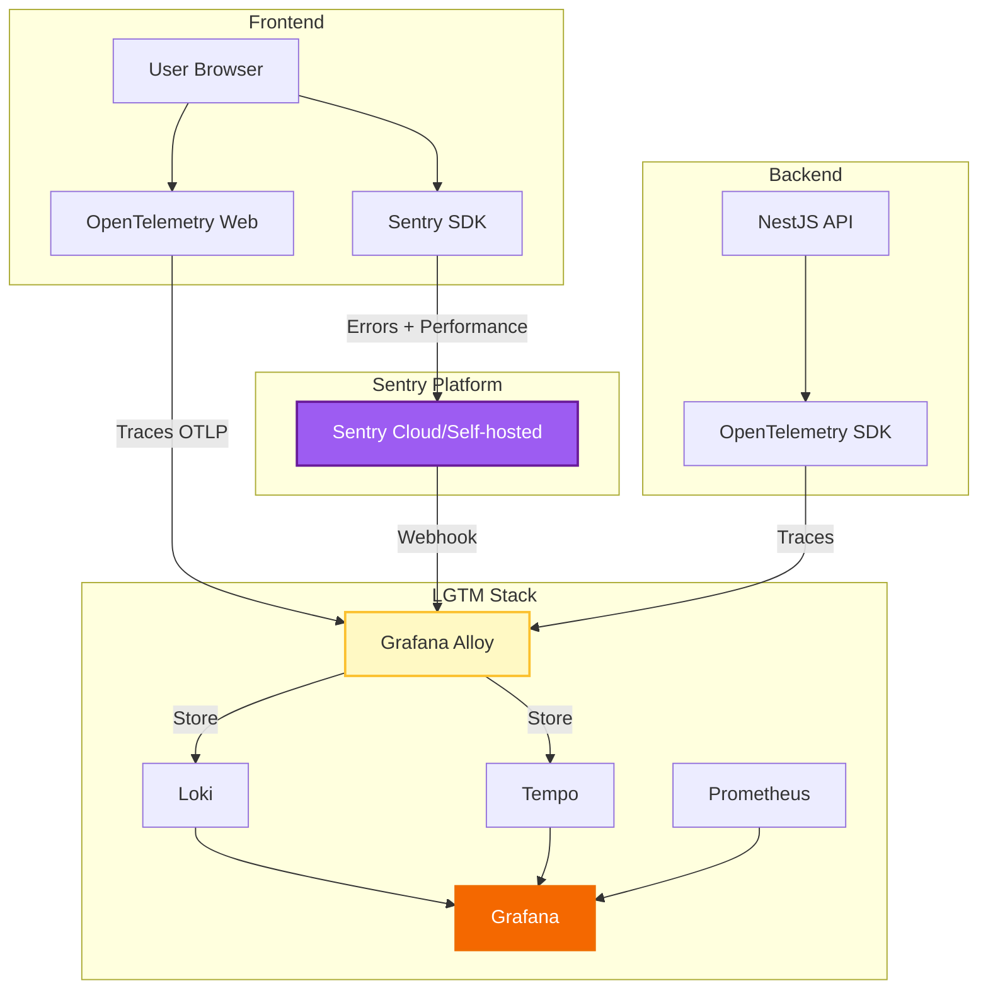

# 🔗 Sentry Integration với LGTM Stack

> **Tài liệu này hướng dẫn tích hợp Sentry (Frontend Error Tracking) vào hệ thống LGTM Stack hiện có.**

## 📋 Mục lục

- [1. Tổng quan](#1-tổng-quan)
- [2. Kiến trúc Tích hợp](#2-kiến-trúc-tích-hợp)
- [3. Setup Sentry Webhook → Loki](#3-setup-sentry-webhook--loki)
- [4. Trace Correlation](#4-trace-correlation)
- [5. Grafana Dashboard](#5-grafana-dashboard)
- [6. Workflow Debug](#6-workflow-debug)

---

## 1. Tổng quan

### Tại sao tích hợp Sentry?

**Sentry** là công cụ error tracking cho Frontend, giúp:
- ✅ Capture errors từ user browsers
- ✅ Stack traces chi tiết
- ✅ User context (email, ID, browser)
- ✅ Release tracking
- ✅ Session replay (paid feature)

**Vấn đề**: Sentry và LGTM Stack hoạt động độc lập → Khó correlation

**Giải pháp**: Tích hợp Sentry vào LGTM Stack để:
- 📊 Visualize Sentry errors trong Grafana
- 🔗 Link Sentry errors với backend traces
- 💾 Long-term storage Sentry events trong Loki
- 🎯 Unified debugging workflow

---

## 2. Kiến trúc Tích hợp



### Data Flow

1. **Frontend Error** → Sentry SDK capture → Sentry Platform
2. **Sentry** → Webhook → Grafana Alloy
3. **Alloy** → Parse & Forward → Loki
4. **Grafana** → Query Loki → Visualize Sentry errors

---

## 3. Setup Sentry Webhook → Loki

### Step 1: Configure Grafana Alloy

**File**: `grafana-prometheus/alloy/config.alloy`

Thêm vào cuối file:

```hcl
// ============================================
// Sentry Integration
// ============================================

// Nhận Sentry webhooks
loki.source.webhook "sentry_webhook" {
  http {
    listen_address = "0.0.0.0"
    listen_port    = 9999
  }
  
  forward_to = [loki.process.sentry.receiver]
}

// Process Sentry events
loki.process "sentry" {
  forward_to = [loki.write.default.receiver]
  
  // Parse JSON từ Sentry
  stage.json {
    expressions = {
      event_id    = "event_id",
      level       = "level",
      message     = "message",
      project     = "project",
      environment = "environment",
      timestamp   = "timestamp",
      user_email  = "user.email",
      user_id     = "user.id",
      url         = "request.url",
      trace_id    = "tags.trace_id",
      error_type  = "exception.values[0].type",
      error_value = "exception.values[0].value",
    }
  }
  
  // Add labels
  stage.labels {
    values = {
      source      = "sentry",
      level       = "",
      project     = "",
      environment = "",
    }
  }
  
  // Format log line
  stage.template {
    source   = "formatted_message"
    template = "{{ .level }} | {{ .project }} | {{ .message }} | User: {{ .user_email }}"
  }
  
  stage.output {
    source = "formatted_message"
  }
}
```

### Step 2: Update Docker Compose

**File**: `grafana-prometheus/docker-compose.yml`

Thêm port 9999 vào service `alloy`:

```yaml
alloy:
  image: grafana/alloy:latest
  container_name: alloy
  ports:
    - "4317:4317"   # OTLP gRPC
    - "4318:4318"   # OTLP HTTP
    - "12345:12345" # Alloy UI
    - "9999:9999"   # Sentry Webhook ← Thêm dòng này
  # ... rest of config
```

### Step 3: Restart Alloy

```bash
cd grafana-prometheus
docker-compose restart alloy

# Verify
docker-compose logs -f alloy
# Should see: "Listening on :9999"
```

### Step 4: Configure Sentry Webhook

#### Option A: Sentry Cloud

1. Vào **Sentry.io** → **Settings** → **Developer Settings**
2. Click **Internal Integrations** → **Create New Integration**
3. Điền thông tin:
   - **Name**: `Grafana LGTM`
   - **Webhook URL**: `http://YOUR_SERVER_IP:9999`
   - **Permissions**: Read `Event`, `Issue`
4. **Webhooks**: Enable các events:
   - ✅ `error.created`
   - ✅ `issue.created`
   - ✅ `issue.resolved`
5. **Save Changes**

#### Option B: Sentry Self-hosted

**File**: `sentry/config.yml`

```yaml
system.url-prefix: 'https://sentry.your-domain.com'

# Webhook configuration
webhooks.enabled: true
webhooks.url: 'http://alloy:9999'
```

### Step 5: Test Webhook

**Trigger test error từ frontend**:

```javascript
// Frontend test
Sentry.captureException(new Error('Test error from frontend'));
```

**Verify trong Loki**:

```logql
{source="sentry"} | json
```

**Expected output**:
```
error | frontend-app | Test error from frontend | User: user@example.com
```

---

## 4. Trace Correlation

### Mục tiêu

Link Sentry errors với backend traces bằng `trace_id`.

### Step 1: Frontend - Add trace_id to Sentry

**File**: `frontend/src/monitoring/sentry.ts`

```typescript
import * as Sentry from '@sentry/react';
import { trace } from '@opentelemetry/api';

Sentry.init({
  dsn: process.env.REACT_APP_SENTRY_DSN,
  environment: process.env.NODE_ENV,
  integrations: [
    new Sentry.BrowserTracing({
      tracePropagationTargets: [
        'localhost',
        'https://api.your-domain.com',
      ],
    }),
  ],
  
  // Thêm trace_id vào mọi Sentry event
  beforeSend(event, hint) {
    // Get active trace
    const activeSpan = trace.getActiveSpan();
    
    if (activeSpan) {
      const { traceId, spanId } = activeSpan.spanContext();
      
      // Add as tags
      event.tags = {
        ...event.tags,
        trace_id: traceId,
        span_id: spanId,
      };
      
      // Add Grafana link
      const grafanaUrl = `https://grafana.your-domain.com/explore?left={"datasource":"tempo","queries":[{"query":"${traceId}"}]}`;
      
      event.extra = {
        ...event.extra,
        grafana_trace_url: grafanaUrl,
      };
      
      // Add to contexts
      event.contexts = {
        ...event.contexts,
        trace: {
          trace_id: traceId,
          span_id: spanId,
        },
      };
    }
    
    return event;
  },
});

export default Sentry;
```

### Step 2: Frontend - Propagate trace to backend

```typescript
// Frontend API call
import { context, propagation } from '@opentelemetry/api';

async function callAPI(endpoint: string, data: any) {
  const headers: Record<string, string> = {
    'Content-Type': 'application/json',
  };
  
  // Inject trace context vào headers
  propagation.inject(context.active(), headers);
  
  try {
    const response = await fetch(endpoint, {
      method: 'POST',
      headers,
      body: JSON.stringify(data),
    });
    
    if (!response.ok) {
      throw new Error(`API error: ${response.status}`);
    }
    
    return await response.json();
  } catch (error) {
    // Sentry sẽ capture với trace_id
    Sentry.captureException(error, {
      tags: {
        api_endpoint: endpoint,
      },
    });
    throw error;
  }
}
```

### Step 3: Backend - Extract trace context

**File**: `backend/src/main.ts`

```typescript
import { NestFactory } from '@nestjs/core';
import { AppModule } from './app.module';
import { context, propagation } from '@opentelemetry/api';

async function bootstrap() {
  const app = await NestFactory.create(AppModule);
  
  // Middleware để extract trace context
  app.use((req, res, next) => {
    const ctx = propagation.extract(context.active(), req.headers);
    context.with(ctx, () => {
      next();
    });
  });
  
  await app.listen(3000);
}
bootstrap();
```

### Step 4: Verify Correlation

**Workflow**:

1. **Frontend error xảy ra** → Sentry capture với `trace_id: abc-123`
2. **Xem trong Sentry**:
   - Tags: `trace_id: abc-123`
   - Extra: Link to Grafana
3. **Click link** → Mở Grafana Tempo với trace `abc-123`
4. **Xem full trace**:
   ```
   Frontend → API Gateway → Payment Service → Database
   ```
5. **Query logs trong Loki**:
   ```logql
   {service_name="payment"} | json | trace_id="abc-123"
   ```

---

## 5. Grafana Dashboard

### Create Sentry Errors Dashboard

**File**: `grafana-prometheus/grafana/provisioning/dashboards/sentry-errors.json`

```json
{
  "dashboard": {
    "title": "Sentry Frontend Errors",
    "uid": "sentry-errors",
    "tags": ["sentry", "frontend", "errors"],
    "timezone": "browser",
    "panels": [
      {
        "id": 1,
        "title": "Error Count Over Time",
        "type": "graph",
        "gridPos": { "h": 8, "w": 12, "x": 0, "y": 0 },
        "datasource": "Loki",
        "targets": [
          {
            "expr": "sum(count_over_time({source=\"sentry\"}[5m]))",
            "legendFormat": "Total Errors"
          },
          {
            "expr": "sum by (level) (count_over_time({source=\"sentry\"}[5m]))",
            "legendFormat": "{{level}}"
          }
        ],
        "fieldConfig": {
          "defaults": {
            "color": { "mode": "palette-classic" }
          }
        }
      },
      {
        "id": 2,
        "title": "Errors by Project",
        "type": "piechart",
        "gridPos": { "h": 8, "w": 12, "x": 12, "y": 0 },
        "datasource": "Loki",
        "targets": [
          {
            "expr": "sum by (project) (count_over_time({source=\"sentry\"}[1h]))"
          }
        ]
      },
      {
        "id": 3,
        "title": "Recent Errors",
        "type": "logs",
        "gridPos": { "h": 12, "w": 24, "x": 0, "y": 8 },
        "datasource": "Loki",
        "targets": [
          {
            "expr": "{source=\"sentry\"} | json | line_format \"{{.timestamp}} | {{.level}} | {{.project}} | {{.message}} | User: {{.user_email}} | trace_id: {{.trace_id}}\""
          }
        ],
        "options": {
          "showTime": true,
          "wrapLogMessage": true
        }
      },
      {
        "id": 4,
        "title": "Top Error Types",
        "type": "table",
        "gridPos": { "h": 8, "w": 12, "x": 0, "y": 20 },
        "datasource": "Loki",
        "targets": [
          {
            "expr": "topk(10, sum by (error_type) (count_over_time({source=\"sentry\"} | json [24h])))"
          }
        ]
      },
      {
        "id": 5,
        "title": "Errors by User",
        "type": "table",
        "gridPos": { "h": 8, "w": 12, "x": 12, "y": 20 },
        "datasource": "Loki",
        "targets": [
          {
            "expr": "topk(10, sum by (user_email) (count_over_time({source=\"sentry\"} | json | user_email != \"\" [24h])))"
          }
        ]
      }
    ],
    "refresh": "30s",
    "time": {
      "from": "now-6h",
      "to": "now"
    }
  }
}
```

### Import Dashboard

```bash
# Restart Grafana để load dashboard
cd grafana-prometheus
docker-compose restart grafana

# Access dashboard
# http://localhost:3000/d/sentry-errors
```

---

## 6. Workflow Debug

### Kịch bản: User báo lỗi "Checkout không hoạt động"

#### Step 1: Check Sentry

1. Vào **Sentry** → **Issues**
2. Tìm issue mới nhất liên quan "checkout"
3. Xem chi tiết:
   - **Error**: `TypeError: Cannot read property 'total' of undefined`
   - **User**: `user@example.com`
   - **Time**: `14:30:15`
   - **Tags**: `trace_id: abc-123-def-456`
   - **URL**: `/checkout`

#### Step 2: Jump to Grafana Trace

1. Click link **Grafana Trace URL** trong Sentry Extra
2. Hoặc manual query trong Grafana:
   ```
   Datasource: Tempo
   Query: abc-123-def-456
   ```
3. Xem trace waterfall:
   ```
   POST /api/checkout (500ms)
   ├─ Validate cart (50ms)
   ├─ Calculate total (10ms) ← Error here
   └─ Create order (not reached)
   ```

#### Step 3: Check Backend Logs

```logql
{service_name="checkout"} 
  | json 
  | trace_id="abc-123-def-456"
```

**Kết quả**:
```
14:30:15 ERROR Calculate total failed: cart.items is null
14:30:15 ERROR Stack trace: at calculateTotal (checkout.service.ts:45)
```

#### Step 4: Root Cause

**Phát hiện**: Backend không validate `cart.items` trước khi tính total

**Fix**:
```typescript
// Before (bad)
const total = cart.items.reduce((sum, item) => sum + item.price, 0);

// After (good)
if (!cart.items || cart.items.length === 0) {
  throw new BadRequestException('Cart is empty');
}
const total = cart.items.reduce((sum, item) => sum + item.price, 0);
```

#### Step 5: Verify

1. Deploy fix
2. Check Sentry: Không còn error mới
3. Check Grafana: Error rate về 0

---

## 📊 Queries Hữu ích

### Loki Queries

```logql
# Tất cả Sentry errors trong 1 giờ qua
{source="sentry"} | json

# Errors của user cụ thể
{source="sentry"} | json | user_email="user@example.com"

# Errors của project cụ thể
{source="sentry", project="frontend-app"} | json

# Errors có trace_id (có thể correlation)
{source="sentry"} | json | trace_id != ""

# Top error messages
topk(10, 
  sum by (message) (
    count_over_time({source="sentry"} | json [24h])
  )
)

# Error rate by level
sum by (level) (rate({source="sentry"} | json [5m]))
```

### Tempo Queries

```
# Tìm trace từ Sentry
trace_id = "abc-123-def-456"

# Tìm tất cả traces có error
{status = error}

# Traces của service cụ thể
{service.name = "checkout-service"}
```

---

## 🔧 Troubleshooting

### Sentry webhook không hoạt động

**Check 1**: Verify Alloy đang listen

```bash
docker exec alloy netstat -tuln | grep 9999
# Should see: tcp 0.0.0.0:9999
```

**Check 2**: Test webhook manually

```bash
curl -X POST http://localhost:9999 \
  -H "Content-Type: application/json" \
  -d '{
    "event_id": "test-123",
    "level": "error",
    "message": "Test error",
    "project": "test-project"
  }'
```

**Check 3**: Xem Alloy logs

```bash
docker-compose logs -f alloy | grep sentry
```

### Không thấy trace_id trong Sentry

**Check**: Frontend có propagate trace context không?

```javascript
// Debug: Log headers trước khi gửi
console.log('Request headers:', headers);
// Should see: traceparent: 00-abc123...
```

### Grafana không query được Sentry logs

**Check**: Loki có nhận được data không?

```bash
# Query trực tiếp Loki API
curl -G http://localhost:3100/loki/api/v1/query \
  --data-urlencode 'query={source="sentry"}' \
  --data-urlencode 'limit=10'
```

---

## 📚 Tài liệu tham khảo

- [Sentry Documentation](https://docs.sentry.io/)
- [Sentry Webhooks](https://docs.sentry.io/product/integrations/integration-platform/webhooks/)
- [OpenTelemetry JS](https://opentelemetry.io/docs/instrumentation/js/)
- [Grafana Alloy](https://grafana.com/docs/alloy/)
- [Loki LogQL](https://grafana.com/docs/loki/latest/logql/)

---

**Version**: 1.0  
**Last Updated**: 2026-01-26  
**Author**: DevOps Team
