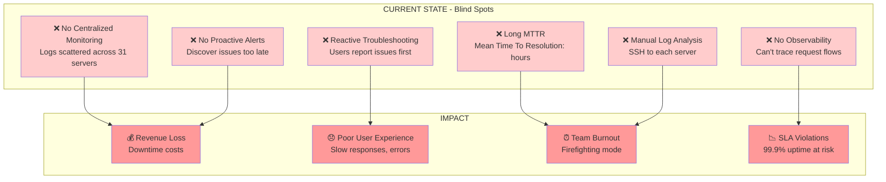
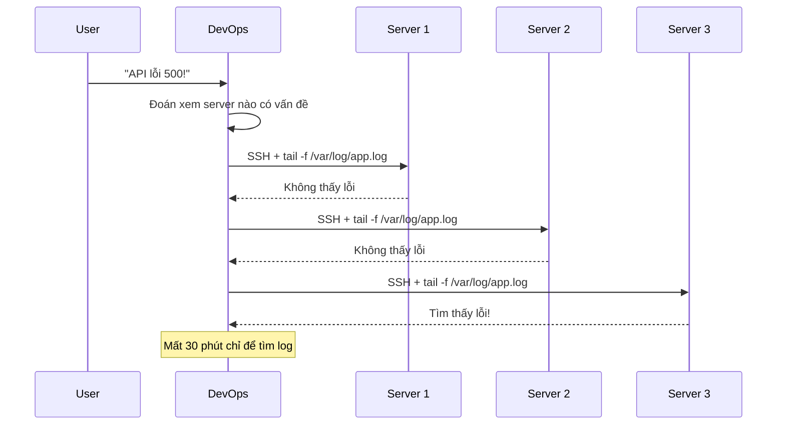
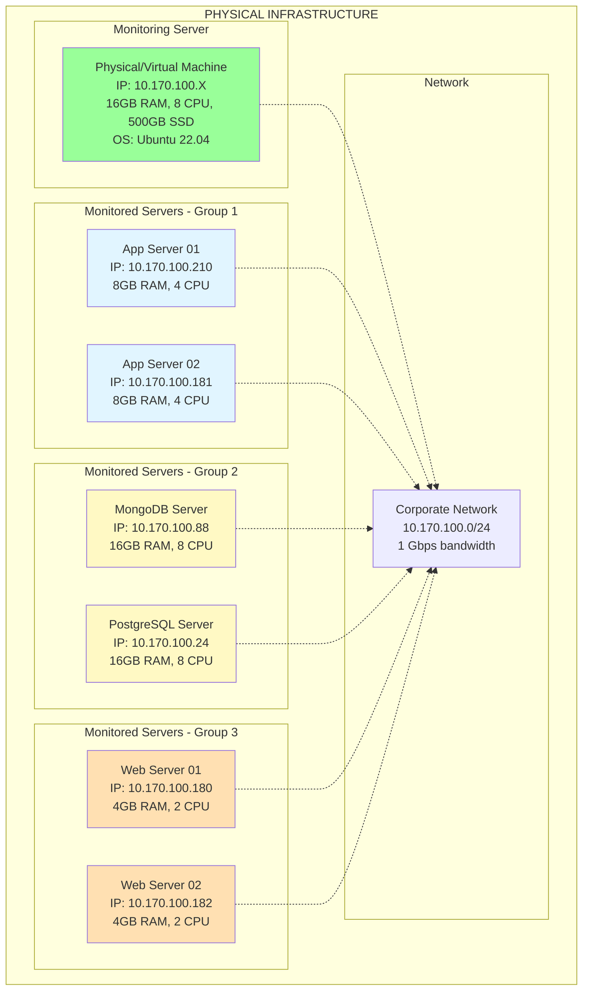
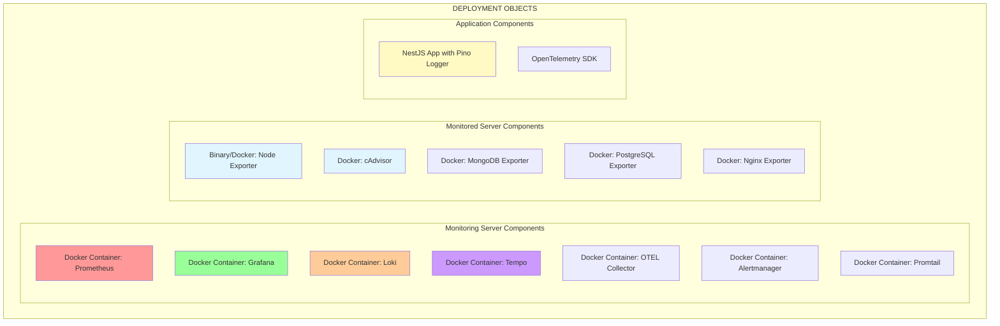
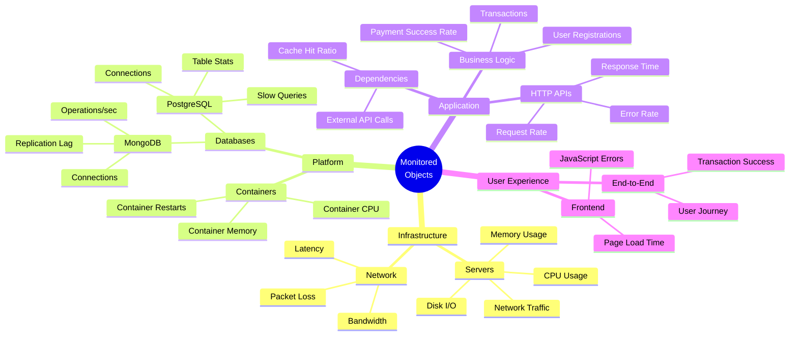
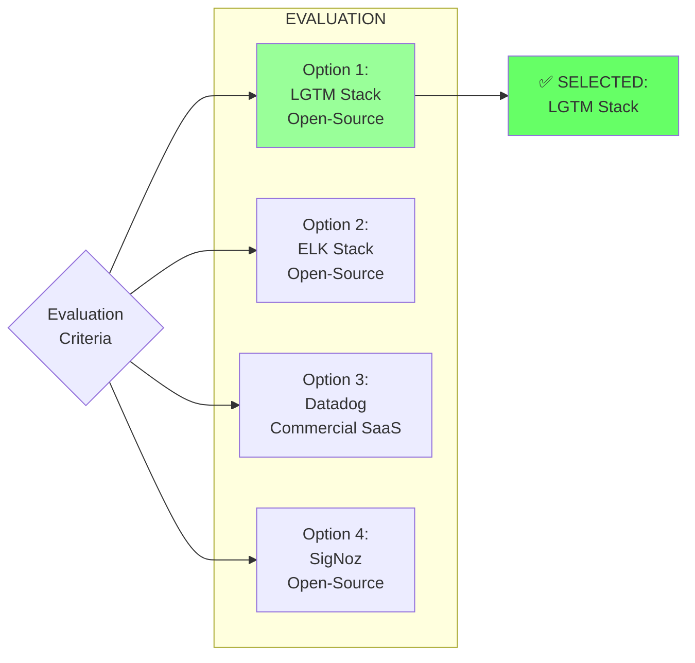
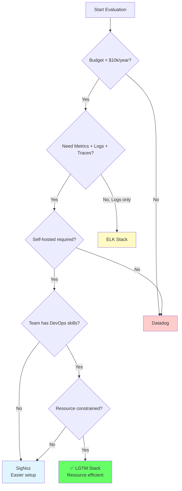
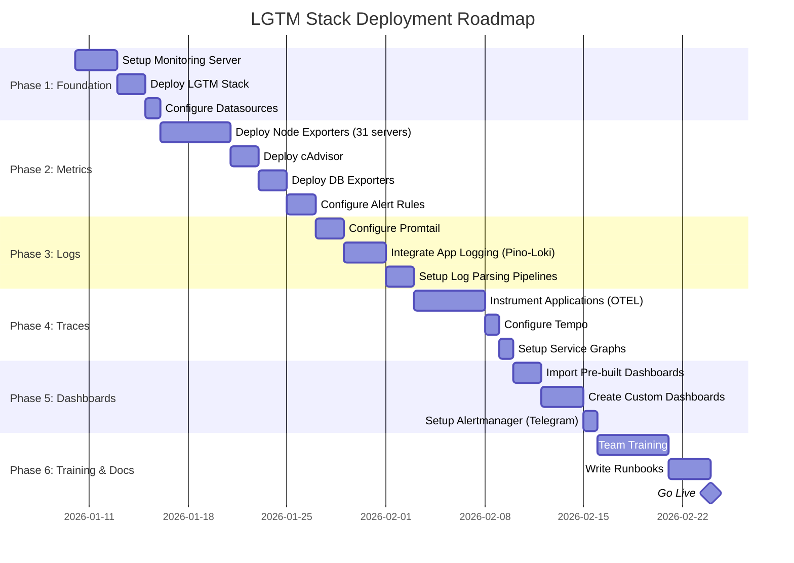

# PHÂN TÍCH VẤN ĐỀ VÀ LỰA CHỌN GIẢI PHÁP

> **Tài liệu này phân tích vấn đề monitoring, so sánh các giải pháp, và giải thích lý do lựa chọn LGTM Stack**

## 📋 Mục lục

- [1. Bối cảnh và Vấn đề](#1-bối-cảnh-và-vấn-đề)
- [2. Yêu cầu Hệ thống Monitoring](#2-yêu-cầu-hệ-thống-monitoring)
- [3. Phân loại Đối tượng](#3-phân-loại-đối-tượng)
- [4. So sánh Giải pháp](#4-so-sánh-giải-pháp)
- [5. Quyết định Lựa chọn](#5-quyết-định-lựa-chọn)
- [6. Roadmap Triển khai](#6-roadmap-triển-khai)

---

## 1. Bối cảnh và Vấn đề

### 1.1. Bối cảnh Dự án

**Quy mô hạ tầng hiện tại**:
- **31+ servers** đang vận hành
- **Multiple environments**: Production, Staging, Test
- **Diverse technology stack**:
  - Application servers (NestJS, Node.js)
  - Database servers (MongoDB, PostgreSQL)
  - Web servers (Nginx)
  - Container orchestration (Docker)

**Thách thức hiện tại**:



### 1.2. Vấn đề Cụ thể

#### Vấn đề 1: Không có Tầm nhìn Tổng thể (No Visibility)

**Triệu chứng**:
- Không biết server nào đang có vấn đề
- Không biết CPU/RAM/Disk usage của từng server
- Không biết application có lỗi hay không

**Ví dụ thực tế**:
```
User: "API chậm quá!"
DevOps: "Chậm ở đâu? Server nào? Endpoint nào?"
→ Phải SSH vào 10 servers để check logs
→ Mất 2 giờ mới tìm ra: MongoDB connection pool đầy
```

#### Vấn đề 2: Troubleshooting Mất Thời gian

**Workflow hiện tại**:


**Thời gian trung bình**:
- Phát hiện vấn đề: 10-30 phút (user báo)
- Tìm root cause: 1-3 giờ
- Fix và deploy: 30 phút - 2 giờ
- **MTTR (Mean Time To Resolution): 2-5 giờ**

#### Vấn đề 3: Không Proactive

**Hiện trạng**:
- ❌ Không có alerts khi disk đầy
- ❌ Không biết khi nào CPU spike
- ❌ Không biết database slow queries
- ❌ Phát hiện vấn đề khi user complain

**Hậu quả**:
```
Timeline của một incident:
10:00 - Disk usage 95% (không ai biết)
10:30 - Disk full, app crash (không ai biết)
11:00 - Users báo "website down"
11:05 - DevOps bắt đầu investigate
12:00 - Tìm ra nguyên nhân: disk full
12:30 - Clean up disk, restart app

→ Downtime: 2.5 giờ
→ Có thể tránh được nếu có alert khi disk 90%
```

---

## 2. Yêu cầu Hệ thống Monitoring

### 2.1. Functional Requirements

| ID | Requirement | Priority | Rationale |
|----|-------------|----------|-----------|
| **FR-1** | Thu thập metrics từ 31+ servers | Critical | Cần visibility toàn bộ hạ tầng |
| **FR-2** | Tổng hợp logs từ tất cả sources | Critical | Centralized logging cho troubleshooting |
| **FR-3** | Distributed tracing cho APIs | High | Debug microservices performance |
| **FR-4** | Real-time alerting (Telegram) | Critical | Proactive incident detection |
| **FR-5** | Unified dashboard (single pane of glass) | High | Giảm context switching |
| **FR-6** | Correlation: metrics ↔ logs ↔ traces | High | Faster root cause analysis |
| **FR-7** | Historical data (15 days metrics, 7 days logs) | Medium | Trend analysis, capacity planning |
| **FR-8** | Self-hosted (on-premise) | Critical | Data sovereignty, cost control |

### 2.2. Non-Functional Requirements

| Category | Requirement | Target |
|----------|-------------|--------|
| **Performance** | Query response time | < 3 seconds |
| **Scalability** | Support growth to 100+ servers | Horizontal scaling |
| **Availability** | Monitoring system uptime | 99.9% |
| **Usability** | Learning curve for team | < 1 week |
| **Cost** | Total cost of ownership | < $500/month |
| **Maintainability** | DevOps effort | < 4 hours/week |

### 2.3. Key Metrics to Monitor

**Infrastructure (Golden Signals)**:
- **Latency**: Response time (p50, p95, p99)
- **Traffic**: Request rate (req/sec)
- **Errors**: Error rate (%)
- **Saturation**: CPU, Memory, Disk, Network usage

**Application**:
- HTTP request duration
- HTTP status codes (2xx, 4xx, 5xx)
- Database query duration
- External API call duration

**Database**:
- Connection pool usage
- Slow queries (> 1s)
- Replication lag
- Cache hit ratio

---

## 3. Phân loại Đối tượng

### 3.1. Đối tượng Vật lý (Physical Objects)



**Tổng quan**:
- **1 Monitoring Server**: Chứa toàn bộ LGTM Stack
- **31+ Monitored Servers**: Các máy chủ được giám sát
- **1 Corporate Network**: Kết nối tất cả servers

### 3.2. Đối tượng Triển khai (Deployment Objects)



**Phân loại theo vai trò**:

| Object Type | Deployment Location | Count | Purpose |
|-------------|---------------------|-------|---------|
| **LGTM Stack** | Monitoring Server | 7 containers | Core monitoring platform |
| **System Exporters** | All Monitored Servers | 31+ instances | Collect system metrics |
| **Service Exporters** | Specific Servers | Variable | Collect service-specific metrics |
| **Application Instrumentation** | Application Servers | Per app | Generate traces & logs |

### 3.3. Đối tượng Được Monitor (Monitored Objects)



**Chi tiết từng layer**:

#### Layer 1: Infrastructure Monitoring

**Đối tượng**: Physical/Virtual machines

**Metrics thu thập**:
- CPU: usage, load average, context switches
- Memory: used, available, swap
- Disk: usage, I/O operations, latency
- Network: bytes in/out, errors, dropped packets

**Tool**: Node Exporter

#### Layer 2: Platform Monitoring

**Đối tượng**: Containers, Databases, Message Queues

**Metrics thu thập**:
- **Containers** (cAdvisor):
  - Per-container CPU/Memory
  - Container restarts
  - Image versions
  
- **MongoDB** (MongoDB Exporter):
  - Connection pool usage
  - Operations per second (insert, update, delete)
  - Replication lag
  - Slow queries
  
- **PostgreSQL** (PostgreSQL Exporter):
  - Active connections
  - Transaction rate
  - Table/Index sizes
  - Slow queries (> 1s)

#### Layer 3: Application Monitoring

**Đối tượng**: APIs, Services, Business Logic

**Metrics thu thập**:
- **HTTP Requests**:
  - Rate (requests/sec)
  - Duration (p50, p95, p99)
  - Status codes (2xx, 4xx, 5xx)
  
- **Traces**:
  - Request flow across services
  - Span duration per operation
  - Error traces
  
- **Logs**:
  - Application errors
  - Business events
  - Audit logs

**Tool**: OpenTelemetry SDK, Pino Logger

#### Layer 4: User Experience Monitoring

**Đối tượng**: End-user interactions

**Metrics thu thập** (future scope):
- Frontend performance (page load time)
- Real User Monitoring (RUM)
- Synthetic monitoring (uptime checks)

---

## 4. So sánh Giải pháp

### 4.1. Các Giải pháp Được Xem xét



### 4.2. Ma trận So sánh Chi tiết

| Criteria | LGTM Stack | ELK Stack | Datadog | SigNoz | Weight |
|----------|------------|-----------|---------|---------|--------|
| **Cost** | ⭐⭐⭐⭐⭐ Free | ⭐⭐⭐⭐ Free | ⭐⭐ $$$$ | ⭐⭐⭐⭐⭐ Free | 25% |
| **Unified Observability** | ⭐⭐⭐⭐⭐ M+L+T | ⭐⭐⭐ Logs only | ⭐⭐⭐⭐⭐ M+L+T | ⭐⭐⭐⭐⭐ M+L+T | 20% |
| **Ease of Setup** | ⭐⭐⭐⭐ Moderate | ⭐⭐⭐ Complex | ⭐⭐⭐⭐⭐ Easy | ⭐⭐⭐⭐ Moderate | 15% |
| **Resource Usage** | ⭐⭐⭐⭐ Low | ⭐⭐ High | ⭐⭐⭐⭐⭐ N/A | ⭐⭐⭐⭐ Low | 15% |
| **Scalability** | ⭐⭐⭐⭐ Good | ⭐⭐⭐⭐ Good | ⭐⭐⭐⭐⭐ Excellent | ⭐⭐⭐ Moderate | 10% |
| **Community Support** | ⭐⭐⭐⭐ Strong | ⭐⭐⭐⭐⭐ Huge | ⭐⭐⭐⭐ Good | ⭐⭐⭐ Growing | 5% |
| **Data Sovereignty** | ⭐⭐⭐⭐⭐ Self-hosted | ⭐⭐⭐⭐⭐ Self-hosted | ⭐ SaaS only | ⭐⭐⭐⭐⭐ Self-hosted | 10% |
| **Total Score** | **4.45** | **3.55** | **3.85** | **4.15** | **100%** |

### 4.3. Phân tích Chi tiết Từng Giải pháp

#### Option 1: LGTM Stack (Loki, Grafana, Tempo, Prometheus)

**Ưu điểm** ✅:
- ✅ **Cost-effective**: Hoàn toàn miễn phí, không có licensing fees
- ✅ **Unified Observability**: Metrics + Logs + Traces trong một platform
- ✅ **Resource Efficient**: Loki chỉ index labels, không index log content → tiết kiệm storage
- ✅ **Grafana Integration**: Single pane of glass, correlation giữa M-L-T
- ✅ **Cloud-Native**: Thiết kế cho Kubernetes, containers
- ✅ **OpenTelemetry Support**: Standard instrumentation
- ✅ **Self-hosted**: Full control, data sovereignty

**Nhược điểm** ❌:
- ❌ **Complexity**: Cần quản lý 7 components
- ❌ **Learning Curve**: Team cần học LogQL, PromQL, TraceQL
- ❌ **No Official Support**: Community support only
- ❌ **Manual HA Setup**: Cần tự config high availability

**Total Cost of Ownership (3 năm)**:
```
Infrastructure: $0 (sử dụng existing servers)
Licensing: $0
DevOps Time: 4 hours/week × 52 weeks × 3 years × $50/hour = $31,200
Training: 1 week × 3 people × $400/day × 5 days = $6,000
Total: $37,200
```

#### Option 2: ELK Stack (Elasticsearch, Logstash, Kibana)

**Ưu điểm** ✅:
- ✅ **Powerful Search**: Full-text search trên logs
- ✅ **Mature**: Đã tồn tại > 10 năm, battle-tested
- ✅ **Rich Visualizations**: Kibana dashboards rất mạnh
- ✅ **Large Community**: Nhiều tutorials, plugins

**Nhược điểm** ❌:
- ❌ **Logs Only**: Không có native metrics/traces (cần thêm Metricbeat, APM)
- ❌ **Resource Hungry**: Elasticsearch cần nhiều RAM (8-16GB minimum)
- ❌ **Complex Setup**: Logstash pipelines phức tạp
- ❌ **Licensing Changes**: Elastic License (không phải pure open-source)
- ❌ **High Storage Cost**: Index toàn bộ log content

**Total Cost of Ownership (3 năm)**:
```
Infrastructure: $200/month × 36 months = $7,200 (larger servers)
Licensing: $0 (basic tier)
DevOps Time: 6 hours/week × 52 weeks × 3 years × $50/hour = $46,800
Training: 2 weeks × 3 people × $400/day × 5 days = $12,000
Total: $66,000
```

#### Option 3: Datadog (Commercial SaaS)

**Ưu điểm** ✅:
- ✅ **All-in-One**: Metrics, Logs, Traces, RUM, Synthetics
- ✅ **Easy Setup**: Agent install, done
- ✅ **600+ Integrations**: Out-of-the-box dashboards
- ✅ **24/7 Support**: Enterprise support
- ✅ **No Maintenance**: Fully managed

**Nhược điểm** ❌:
- ❌ **Expensive**: $15-31/host/month + $0.10/GB logs
- ❌ **Vendor Lock-in**: Proprietary platform
- ❌ **Data Sovereignty**: Data stored in Datadog cloud
- ❌ **Unpredictable Costs**: Costs scale with usage
- ❌ **Limited Customization**: Can't modify platform

**Total Cost of Ownership (3 năm)**:
```
Datadog Pricing (31 hosts):
- Infrastructure Monitoring: $15/host/month × 31 × 36 = $16,740
- Log Management: $0.10/GB × 100GB/day × 30 days × 36 = $10,800
- APM: $31/host/month × 10 × 36 = $11,160
Total: $38,700

DevOps Time: 1 hour/week × 52 weeks × 3 years × $50/hour = $7,800
Training: 3 days × 3 people × $400/day = $3,600
Total: $50,100
```

#### Option 4: SigNoz (Open-Source APM)

**Ưu điểm** ✅:
- ✅ **Unified Platform**: Metrics, Logs, Traces
- ✅ **Open-Source**: Free, self-hosted
- ✅ **Modern UI**: Better UX than Grafana
- ✅ **ClickHouse Backend**: Fast queries

**Nhược điểm** ❌:
- ❌ **Young Project**: Less mature (started 2021)
- ❌ **Smaller Community**: Fewer resources
- ❌ **Limited Integrations**: Fewer exporters than Prometheus
- ❌ **ClickHouse Complexity**: New database to manage

### 4.4. Decision Matrix



---

## 5. Quyết định Lựa chọn

### 5.1. Lý do Chọn LGTM Stack

**Quyết định**: ✅ **LGTM Stack (Loki + Grafana + Tempo + Prometheus)**

**Rationale**:

1. **Cost-Effective** (Weight: 25%)
   - Zero licensing cost
   - TCO thấp nhất trong 3 năm: $37,200 vs $66,000 (ELK) vs $50,100 (Datadog)
   - Phù hợp với budget constraint

2. **Unified Observability** (Weight: 20%)
   - Đáp ứng đầy đủ 3 pillars: Metrics + Logs + Traces
   - Correlation giữa M-L-T trong Grafana
   - ELK chỉ mạnh về Logs

3. **Resource Efficiency** (Weight: 15%)
   - Loki: Label-based indexing → storage nhỏ hơn ELK 10-100x
   - Prometheus: Efficient TSDB
   - Có thể chạy trên existing infrastructure

4. **Data Sovereignty** (Weight: 10%)
   - Self-hosted, full control
   - Compliance với data regulations
   - Datadog không đáp ứng requirement này

5. **Team Skills** (Weight: 15%)
   - Team đã có experience với Prometheus
   - Grafana familiar với team
   - Learning curve chấp nhận được (< 1 week)

6. **Community & Ecosystem** (Weight: 5%)
   - CNCF projects (Prometheus, Grafana)
   - Large community
   - Many integrations

### 5.2. Trade-offs Chấp nhận

**Trade-off 1: Complexity vs Cost**
- ✅ Chấp nhận: Quản lý 7 components
- 💰 Lợi ích: Tiết kiệm $13k-29k/3 năm so với alternatives

**Trade-off 2: Self-managed vs Managed**
- ✅ Chấp nhận: Tự maintain (4 hours/week)
- 🔒 Lợi ích: Data sovereignty, full control

**Trade-off 3: Community Support vs Enterprise Support**
- ✅ Chấp nhận: Không có 24/7 support
- 📚 Lợi ích: Large community, extensive documentation

### 5.3. Risk Mitigation

| Risk | Mitigation Strategy |
|------|---------------------|
| **Complexity** | - Comprehensive documentation<br/>- Team training (1 week)<br/>- Start with core features, expand gradually |
| **No Official Support** | - Active community forums<br/>- Grafana Labs consulting (if needed)<br/>- Internal knowledge base |
| **Single Point of Failure** | - Phase 2: Implement HA architecture<br/>- Regular backups<br/>- Disaster recovery plan |
| **Scalability Limits** | - Monitor resource usage<br/>- Plan for horizontal scaling (Thanos)<br/>- Capacity planning quarterly |

---

## 6. Roadmap Triển khai

### 6.1. Timeline Tổng quan



**Total Duration**: ~6 weeks (30 working days)

### 6.2. Phase 1: Foundation (Week 1)

**Objective**: Setup monitoring server và LGTM Stack core

**Tasks**:

| Day | Task | Owner | Deliverable |
|-----|------|-------|-------------|
| 1 | Provision monitoring server | DevOps | Server ready (16GB RAM, 8 CPU) |
| 1-2 | Install Docker & Docker Compose | DevOps | Docker running |
| 2-3 | Clone repo, configure .env | DevOps | Config files ready |
| 3 | Deploy LGTM Stack (docker-compose up) | DevOps | 7 containers running |
| 4 | Configure Grafana datasources | DevOps | Prometheus, Loki, Tempo connected |
| 5 | Verify stack health | DevOps | All services UP |

**Success Criteria**:
- ✅ Grafana accessible at http://monitoring-server:3000
- ✅ Prometheus scraping itself
- ✅ Loki receiving test logs
- ✅ Tempo ready for traces

### 6.3. Phase 2: Metrics Collection (Week 2)

**Objective**: Deploy exporters và thu thập metrics

**Tasks**:

| Day | Task | Servers | Deliverable |
|-----|------|---------|-------------|
| 1-3 | Deploy Node Exporter | All 31 servers | System metrics flowing |
| 3-4 | Deploy cAdvisor | 10 container hosts | Container metrics flowing |
| 4-5 | Deploy MongoDB Exporter | 3 MongoDB servers | DB metrics flowing |
| 5 | Deploy PostgreSQL Exporter | 2 PostgreSQL servers | DB metrics flowing |
| 5 | Configure Prometheus targets (JSON files) | Monitoring server | All targets scraped |

**Success Criteria**:
- ✅ All 31 Node Exporters UP in Prometheus
- ✅ cAdvisor metrics visible
- ✅ Database metrics visible
- ✅ No scrape errors

### 6.4. Phase 3: Logs Aggregation (Week 3)

**Objective**: Centralize logs từ tất cả sources

**Tasks**:

| Day | Task | Deliverable |
|-----|------|-------------|
| 1 | Configure Promtail for Docker logs | Container logs in Loki |
| 2 | Configure Promtail for system logs | System logs in Loki |
| 3-4 | Integrate Pino-Loki in NestJS apps | App logs in Loki |
| 5 | Setup log parsing pipelines | Structured logs |

**Success Criteria**:
- ✅ Docker container logs visible in Grafana
- ✅ System logs (syslog, auth.log) visible
- ✅ Application logs with trace_id correlation

### 6.5. Phase 4: Distributed Tracing (Week 4)

**Objective**: Instrument applications với OpenTelemetry

**Tasks**:

| Day | Task | Deliverable |
|-----|------|-------------|
| 1-3 | Add OTEL SDK to NestJS apps | Traces generated |
| 3-4 | Configure OTEL Collector | Traces flowing to Tempo |
| 4 | Setup span metrics generation | Span metrics in Prometheus |
| 5 | Test trace correlation with logs | Trace ID in logs |

**Success Criteria**:
- ✅ Traces visible in Grafana Tempo
- ✅ Span metrics available
- ✅ Click trace → jump to logs works

### 6.6. Phase 5: Dashboards & Alerting (Week 5)

**Objective**: Setup dashboards và alerts

**Tasks**:

| Day | Task | Deliverable |
|-----|------|-------------|
| 1 | Import Node Exporter Full dashboard | System metrics dashboard |
| 1 | Import MongoDB dashboard | MongoDB dashboard |
| 2 | Create custom application dashboard | App metrics dashboard |
| 3 | Configure alert rules (CPU, Disk, Memory) | Alert rules active |
| 4 | Setup Alertmanager with Telegram | Alerts sent to Telegram |
| 5 | Test alerting (trigger test alerts) | Alerts working |

**Success Criteria**:
- ✅ 5+ dashboards created
- ✅ 10+ alert rules configured
- ✅ Telegram notifications working

### 6.7. Phase 6: Training & Documentation (Week 6)

**Objective**: Train team và document processes

**Tasks**:

| Day | Task | Deliverable |
|-----|------|-------------|
| 1-2 | Team training: Grafana basics | Team can navigate Grafana |
| 2-3 | Team training: PromQL, LogQL | Team can write queries |
| 3-4 | Write runbooks for common issues | 10+ runbooks |
| 4-5 | Write operational procedures | Ops docs complete |
| 5 | Go-live review & sign-off | Production ready |

**Success Criteria**:
- ✅ All team members trained
- ✅ Runbooks documented
- ✅ On-call rotation defined
- ✅ Escalation procedures clear

### 6.8. Success Metrics (Post Go-Live)

**Track these KPIs**:

| Metric | Baseline (Before) | Target (3 months) |
|--------|-------------------|-------------------|
| **MTTD** (Mean Time To Detect) | 10-30 min | < 5 min |
| **MTTR** (Mean Time To Resolve) | 2-5 hours | < 1 hour |
| **Alert Accuracy** | N/A | > 90% |
| **Dashboard Usage** | 0 views/day | > 50 views/day |
| **Incident Postmortems** | 0% | 100% |
| **Proactive Incidents** | 0% | > 50% |

---

## 📚 Tài liệu Liên quan

- **[DEPLOYMENT.md](./DEPLOYMENT.md)** - Hướng dẫn triển khai chi tiết
- **[NETWORK_ARCHITECTURE.md](./NETWORK_ARCHITECTURE.md)** - Kiến trúc mạng và data flows
- **[INCIDENT_RESPONSE.md](./INCIDENT_RESPONSE.md)** - Quy trình xử lý sự cố (sẽ tạo tiếp)

---

**Version**: 1.0.0  
**Last Updated**: 2026-01-09  
**Maintainer**: DevOps Team
